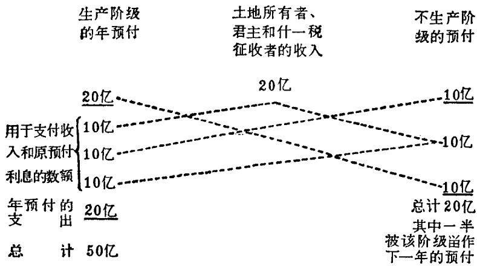

## 第一节 重农学派概述
### 十八世纪法国资产阶级革命前夜的社会概况
重农学派出现于十八世纪五十到七十年代，比布阿吉尔贝尔约晚半个世纪。当时正处于法国资产阶级革命的准备时期。这时法国的社会经济状况已日趋恶化。农村的封建剥削和压迫更为严重。靠牺牲农民而发展工业和商业的重商主义政策，使农业处于极度衰落境地。农民的痛苦遭遇，激起了他们的仇恨和不满，爆发了多次起义。

到了十八世纪中叶，法国工商业虽然有了一定的发展，工人的数量有了增加。但是，由于农民的极端贫困，工业的国内市场极其狭小，加之国内币制不统一，封建政府的各种捐税有增无已，从而大大限制了工商业的发展，引起了工商业资产阶级与封建贵族之间的尖锐矛盾。封建专制政府加给资本家的负担，全部转嫁到工人和其他劳动群众身上。工人遭受资本家和封建贵族的双重剥削和压迫，生活极其痛苦。工人为争取自己的权利，不断地展开斗争，举行了罢工。

在国内财政经济濒临绝境、社会内部矛盾尖锐化的同时，法国的对外战争屡遭失败。在内外困境下，法国路易十五专制政府并没有吸取路易十四时期所实行的柯尔培尔重商主义政策的教训，仍想从重商主义措施中寻找出路。于是，又采纳了约翰·罗的建议。[^1]罗的理论实际上是重商主义的新变种。罗氏“制度”并未挽救危局，不久就彻底破产。

从以上所说可以看出，十八世纪末法国封建专制的政治和经济制度已经走上了不可避免的死亡道路，旧的过时的封建制度必将为新的制度所代替。法国专制政治和封建制度的破产，同时也就是重商主义学说的破产。重商主义已成为法国资本主义进一步发展的障碍，因此遭到了激烈的反对和批判。适应新兴资产阶级的要求，在法国出现了与重商主义完全对立的重农学派。马克思在阐述重农学派的产生时指出：“重农主义的产生，既同反对柯尔培尔主义有关系，又特别是同罗氏制度的破产有关系。”[^2]

### 重农学派的形成及其学说的特点
从十七世纪下半期以来，在法国经济思想的发展中，有些代表人物的言论表现出反对重商主义政策，主张经济自由和重视农业的思潮。例如，在前面讲过的法国资产阶级古典政治经济学的创始人布阿吉尔贝尔的观点中就可以看到。布阿吉尔贝尔是重农学派的前辈。重农主义的有些思想在重农学派之前已逐渐被提出来。重农主义者继承和发展了他们的思想，创立了一个标志着法国古典经济学新阶段的理论体系。

弗朗斯瓦·魁奈(1694—1774年)是重农学派的创始人。他创立了一套完整的重农主义的经济理论，提出了发展法国资本主义的经济政策。由于魁奈的影响，在他的周围出现了一批门徒和追随者，并形成为一个独立的学派。最后，这一学说由重农学派中重要人物杜尔哥加以进一步的发展。由于重农学派最早系统地研究了资本主义生产方式，马克思把重农学派称之为资产阶级政治经济学的真正鼻祖。重农学派虽产生于法国，但它对整个资产阶级古典政治经济学的形成有着重大的影响。

“自然秩序”的学说是重农主义整个学说的出发点。重农主义者的“自然秩序”的观念，实际上是在当时法国启蒙学者的影响下形成的。但是，重农主义者还不能完全摆脱封建思想的影响，他们把自然秩序的学说披上了宗教的外衣，说自然秩序是上帝为了人类幸福而安排的秩序。

重农学派认为与“自然秩序”相对立的是以人们的意志为转移的“人为秩序”，或如魁奈所说的“积极的秩序”。在他们看来，“积极的秩序”就是随不同国家不同时代而变动的人类社会实际存在的状态，具体表现为各种经济政治制度和法令规章等。重农主义者认为，如果人类认识到“自然秩序”，根据自然秩序的准则制定积极秩序，如组织政府，规定各种政策、措施等等，这时这个社会便处于健康的状态，人类便能享受到最大的幸福。相反，如果违反了自然秩序，社会便会陷入疾病的状态。这时就需要强而有力的人物出现，使社会恢复到自然秩序。魁奈认为，这种强有力的人物首先是“开明君主”，他最能体现自然秩序。当社会处于健康状态时，他把自然秩序的观念灌输到人民意识中去，而当社会陷于疾病时，他就进行医治，使社会回到自然秩序中来。

从重农学派关于自然秩序的观念中，可以看出重农主义者实际上已经了解到，在人类社会发展中存在着不以人们意志为转移的客观规律，从而给政治经济学提出了认识客观规律的任务，这是他们的科学功绩。但是，由于他们受资产阶级立场的限制，他们又把资本主义生产方式看作是自然的永恒的生产方式。因此，他们也就把仅仅支配资本主义生产方式的特殊规律，当作支配一切社会形态的永恒不变的规律。马克思指出：“重农学派的巨大功绩是，他们把这些形式看成社会的生理形式，即从生产本身的自然必然性产生的，不以意志、政策等等为转移的形式。这是物质规律；错误只在于，他们把社会的一个特定历史阶段的物质规律看成同样支配着一切社会形式的抽象规律”。[^3]

重农学派的观点是带有浓厚的封建外貌的。从重农学派的理论和主张的本质上看，它所反映的不过是封建社会末期新兴资产阶级的要求。他们的意图不过是想在封建社会的废墟上建立一个新的资本主义社会。然而，每当重农主义者代表资产阶级提出要求时，总是打着“封建招牌”，把他们自己说成是封建阶级的代言人。因此，他们实际上是在研究资本主义生产方式，但自己却认为是研究封建主义生产方式，他们以为自己是在诚心诚意地维护和巩固封建制度。

上述重农学派的特点，是与当时法国的历史条件有密切关联的。重农主义者正处在从封建社会向资本主义社会过渡的时期，这时资本主义刚刚产生，还没有成熟，重农主义者对资本主义社会的真正形态还没有认识清楚，他们还没有彻底脱离封建贵族的立场，所以他们的学说不可避免地会具有封建的外貌。尽管如此，但重农学派的理论还是资产阶级的，他们所描绘的事实上是资产阶级社会。在这个社会里，产业资本家的代表即租地农业资本家阶级，指导社会的全部经济运动。农业是按照资本主义方式经营的，直接的土地耕作者是一无所有的工资劳动者。生产的动机是获取剩余价值，而剩余价值的生产，是在生产领域，不是流通领域。所以马克思指出：“重农主义体系是对资本主义生产的第一个系统的理解。”[^4]

重农学派认为社会财富的根源是农业，是从土地上生产出来的农产品。他们对重商主义者关于社会财富及其来源的看法，进行了猛烈的抨击，指出对外贸易不是社会财富的源泉。按照他们的意见，对外贸易输出产品换回的货币，是毫无用处的，它使国家失去生产和消费所需的产品，这样国家将不得不再设法把这些产品运回，否则必然使国家感到极端匮乏。重农主义者依据他们对社会财富的理解，认为工业也不是社会财富的源泉。

## 第二节 魁奈的经济学说
### 魁奈的生平及其著作
弗朗斯瓦·魁奈是重农学派的创始人。他出身于地主家庭。他的专业是医学，写过不少医学和生物学方面的著作。魁奈五十多岁时当了宫廷侍医，近七十岁时被封为贵族。

魁奈在政治上拥护开明的专制制度。他和十八世纪许多启蒙学者一样，主张由开明君主自上而下地实行改革，以防止革命的风暴。开始他希望路易十五能实现他的建议和改革方案，当他知道不能实现他的愿望时，他又幻想路易十五的继承人能成为他的信徒，实现他的主张。魁奈强烈地反对唯物主义，但他在政治经济学方面，却开拓了一个新的途径。

魁奈大约从1753年才开始研究经济学，当时法国社会上普遍关心经济问题，尤其关心促使人民破产的谷物价格和赋税问题。1756年他写了《农民论》，1757年写了《谷物论》。魁奈在这两篇论文中指出，农村状况的恶化是由于农民的租税负担过重和谷物价格低廉造成的。他还写了《赋税论》等文章，在《赋税论》中，提出了改革税制、实行单一税的主张。1758年，魁奈发表了在政治经济学史上有名的著作《经济表》。

### “纯产品”学说“
纯产品”学说是魁奈经济理论和经济纲领的基石。他关于社会阶级结构、资本以及社会再生产和流通等理论，都是以“纯产品”学说为基础的。

魁奈及其门徒没有提出劳动价值的理论，他们在对商品价值的理解上，比配第和布阿吉尔贝尔后退了一步。但他们已认识到在充分自由竞争的条件下，交换是按等价进行的。这一观点对资产阶级政治经济学的发展起了很大的作用。因为既然交换是等价的，所以流通领域也就不可能是财富的源泉。这样就给了以流通为致富源泉的重商主义观点致命的打击，同时使魁奈把自己的研究重心从流通领域转移到了生产领域，从而为科学地分析社会经济现象提供了可能。

不过，重农主义者只把自己的研究局限于农业生产领域，认为只有农业才能使物质财富的数量增加，只有农业才是生产部门。而在工业部门中，生产所用的原料几乎都是农业供应的。工业的作用只不过是改变由农业所提供的原料的形式，把各种使用价值结合为一种新的使用价值，使之适合于人们的需要。工业是不会使物质财富的数量增加的，它不是生产部门。至于商业当然更不是生产部门。按照魁奈的看法，农业和其他经济部门所以有这种区别，是因为在农业生产中有各种自然力参加工作，进行着“创造”。

魁奈认为，物质财富本身数量的增加，就是农业中生产出来的产品，除了补偿生产过程中耗费的生产资料即种子、工人的生活资料和农业资本家的生活资料外，还有剩余的产品。魁奈指出，这种剩余产品就是“纯产品”。从以上的说明可以看出，魁奈是从使用价值的角度考察财富的，他注意的是使用价值，“纯产品”也就以使用价值形态表现为剩余农产品。

但是，在商品生产的社会里，产品包括农产品是作为商品生产的，产品不仅仅应具有使用价值，而更重要的要具有价值。因此，魁奈所说的“纯产品”，即剩余农产品，就不得不以价值的形式来表现。然而，重农主义者不懂得价值是由什么决定的，当然更不知道价值的本质。他们认为价值也是一种可以感触的、物质的东西，认为价值与使用价值没有区别，价值和使用价值都被认为是自然的、彼此分不开的，凡是具有使用价值的东西，都具有价值，并且认为产品和商品是同一的。所以在他们的心目中，新创造的产品和用于生产上的开支，没有经过科学的说明，就自然而然地直接地采取了价值的形式。这样“纯产品”就是农产品的价值超过为生产这些农产品而必须耗费的价值的余额。可见，魁奈所说的“纯产品”实质上就是剩余价值。

我们知道，剩余价值只有在正确的劳动价值理论的基础上才能加以说明。但是，魁奈是没有正确的价值论的。他认为，农产品的价值是由生产农产品的生产费用决定的。既然如此，农产品的价值和生产费用相等，因而也就无法说明农产品的价值超过生产费用，也就不能说明“纯产品”。按照魁奈的解释，“纯产品”是自然恩赐。因为他认为只有在农业中有自然力参加并发挥作用，所以能使农产品的价值超过生产费用形成“纯产品”。

“纯产品”既然被认为是农产品价值超过生产费用的余额，因此，要确定“纯产品”的数量，必须先确定生产费用的数量。在农业中，生产费用是由生产资料(包括种子)和工人的工资构成的。由于生产资料的价值是既定的，所以“纯产品”的多少，只能决定于工资的多少。魁奈和配第一样，把工资看作是工人必需的生活资料。工资既然是工人必需的生活资料，那末“纯产品”显然只是工人剩余劳动创造出来的，“纯产品”实际上就是劳动者创造出来被资本家无偿占有的剩余价值。它是资本主义生产关系的产物。因为只有在资本主义社会中，劳动力才成为商品，劳动力的价值才决定于劳动者的生活资料的价值，才出现劳动力的价值和应用这个劳动能力所创造的价值之间的差额。但是，由于魁奈对价值的错误观点，使他不可能把剩余价值归结为剩余的劳动时间，而错误地认为它是自然的恩赐，是土地所提供的。

从使用价值的角度看，在农业中，一年生产出来的产品比投下的种子和工人在这一年所消费的生活资料要多，这在物质形态上考察是显而易见的。在工业中，情况就不一样，人们既不能直接看到劳动者生产他的生活资料，也不能从物质形态上直接看到他生产出来的东西超过他的生活资料。生产耗费和生产结果不能直接进行比较，工业品是要通过买卖、通过流通中的各种行为媒介的。因此，不可能从使用价值看到“纯产品”。农业则不同，生产耗费和生产结果可以直接比较，所以在农业生产中，可以明显地从物质上看到劳动者创造了超过其消费以上的剩余产品。这个剩余可以不借助于流通，而直接表现在劳动者所生产的使用价值多于他所消费的使用价值的剩余上面。所以，在农业上虽然不分析价值，剩余价值也可以被理解。正因为如此，所以魁奈断定农业劳动是唯一的生产劳动，“纯产品”即地租成了剩余价值的唯一形态。而资本的利润，对魁奈来说是不存在的。利润被他看作只是给资本家的一种较高的工资，就象普通劳动者的最低工资一样，加到他们的产品费用中去，从而增大了产品的价值。这种被认为是资本家工资的利润，他认为是由土地所有者支付的；利息则被认为是违反自然的高利贷。

魁奈及其追随者，认为只有农业才是唯一的生产部门，只有农业才能生产剩余价值的观点，显然是片面的、不正确的。以自然的恩赐来解释“纯产品”即剩余价值的产生更是错误的。不过，他们第一次提出了一个重要原理，这就是：“纯产品”即剩余价值不是流通领域而是生产领域创造出来的。马克思在评价这一原理时指出：“重农学派把关于剩余价值起源的研究从流通领域转到直接生产领域，这样就为分析资本主义生产奠定了基础。”[^5]

### 《经济表》
魁奈以“纯产品”理论为基础，对社会阶级结构作了论述。他把整个社会成员划分为三个阶级：(一)生产阶级，即从事农业的阶级，其中包括租地农业资本家和农业工人，这个阶级是社会全部经济运动的指导者。魁奈认为，既然只有农业才生产“纯产品”，才是唯一的生产部门，所以从事农业的阶级，就自然而然地成为唯一生产阶级。(二)土地所有者阶级，其中包括地主及其从属人员，国王和官吏以及以什一税的占有者的身分出现的教会等。这个阶级的特点是以地租和租税的形态从农业阶级取得“纯产品”。(三)不生产阶级，或如魁奈所说的不结果实的阶级，包括工商业中资本家和工人。按照魁奈的说法，工商业不创造“纯产品”，所以它是不生产的部门，因而从事工业和商业的阶级就被认为是不生产的，或者说是不结果实的阶级。

显然，魁奈没有正确地揭示出资本主义社会的阶级结构。魁奈没能从生产资料的占有形式来划分阶级，因而他就不可能科学地反映出资本主义的生产关系。按照他的阶级划分，生产阶级不只包括农业劳动者，而且也包括农业资本家；在不生产的阶级内不仅包括了工商业资本家，而且包括了工商业劳动者。这样，也就掩盖了农业资本家、工商业资本家与农业劳动者、工商业劳动者之间的本质区别，掩盖了雇佣劳动者与资本家阶级之间的阶级矛盾和阶级斗争。魁奈及其追随者的这一观点是错误的。

魁奈认为只有农业生产才是真正生产，并把农业看作是“纯产品”的唯一源泉，于是他认定只有投在农业上的资本才是生产的资本，而工业资本则不是生产的资本。至于商业资本，魁奈毫不掩饰地采取了仇视的态度，认为只有在贱买贵卖的欺骗行为中商业利润才能存在。

魁奈把农业资本分为两部分，他说，农业资本中有不同的“两部分预付”：（一）每年要预付出去的部分，如种子、肥料和工人的工资等，也就是“年预付”；（二）几年预付一次的部分，如耕畜、农具、仓库、房屋等，也就是“原预付”。魁奈写道：“年预付是由每年在耕作劳动上的支出构成的；这种预付必须和代表农业创办基金的原预付相区别。”[^6]也就是说，要使生产过程继续不断，“年预付”全部进入生产费用之内，它必须由每年生产物中取得补偿；“原预付”只是部分地进入生产费用，它必须经过相当长的期间，才能完全取得补偿。

从以上所说可以看出，重农学派虽然还没有关于流动资本和固定资本的一般概念，这是后来亚当·斯密提出来的，但是在上述观点中实际上已经有了这种区分。魁奈的这种划分是从再生产的角度出发的，所以这种划分只适用于生产资本，而不适用于流通资本。马克思指出这一观点是重农学派的一个功绩。魁奈认为货币不是固定资本，也不是流动资本，这也是很有创见的。因为这两者都属于生产资本。但是，魁奈却不了解资本在运动中也会采取货币形态，而生产资本形态仅仅是资本的一种形态。

魁奈只把资本在生产领域中所取得的形态看作资本，这虽然是片面的，但比起重商主义的观点已前进了一大步。因为他已经从生产领域中去寻找资本的意义和作用，从而为理解资本的性质开辟了正确道路；同时，他抓住生产资本，这实际上说明他已抓住了具有决定意义的基本形态。以上这些是魁奈探讨再生产的重要理论前提。

魁奈的《经济表》[^7]是政治经济学史上的一个杰出贡献。魁奈在这一有名的著作中，第一次试图说明社会总资本的再生产和流通过程，对社会总资本的简单再生产和流通作了包含有科学见解的最初探索。

魁奈在《经济表》中分析社会总资本再生产时，是从以下几个假设出发的：社会上普遍实行的是大规模租地农业经济；社会资本所进行的是简单再生产，没有资本积累；各主要阶级间的买卖，采用固定价格。然后，他把社会划分为前面已讲过的三个阶级。

从上述的主要假定出发研究再生产，这表明了魁奈的科学创见。因为魁奈把小农经济抽象掉，从而就把研究的对象确定在资本主义的生产范围；采用固定价格，这就去掉了价格变动的复杂因素，因而更便于问题的分析和研究；魁奈把注意力集中在简单再生产上，这正是抓住了再生产的困难所在。马克思指出：“主要的困难……不是发生在对积累的考察上，而是发生在对简单再生产的考察上。”[^8]当然，按照魁奈的见解，不可能对扩大再生产进行分析，因为全部“纯产品”、即剩余价值都归土地所有者所有，农业资本家在这种情况下也就无法扩大投资。

在《经济表》中，是把农业在一年生产出来的总产品作为出发点的。魁奈认为，在新的经济年度开始时，生产阶级在生产中投下价值一百亿利弗尔[^9]的“原预付”、即固定资本，每年投下二十亿利弗尔的“年预付”、即流动资本。魁奈假定“原预付”的资本可用十年，每年平均耗损固定资本十亿。生产阶级每年投下这些资本，创造出价值五十亿利弗尔的年总产品。从实物形式来说，五十亿年总产品中，粮食是四十亿，工业原料为十亿。年总产品的价值构成是：（1）“年预付”的价值二十亿；（2）“原预付”的耗损价值十亿，魁奈称之为“原预付利息”，即固定资本的折旧；（3）“纯产品”即剩余价值二十亿。

在开始流通以前，不生产阶级有二十亿利弗尔的工业品，这是该阶级上年度生产出来的。土地所有者阶级有二十亿利弗尔的货币，这是上年度由生产阶级作为地租交给他们的。

农产品当作商品生产出来之后就进入流通过程。在商品流通过程中需要一定数量的货币。土地所有者手中已有二十亿货币（生产阶级所交付的地租）作为流通之用。

按照魁奈《经济表》，流通进行如下：

土地所有者阶级以二十亿的半数、即十亿货币购买生产阶级的农产品，并向不生产阶级购买其余十亿货币的工业品。生产阶级再以流回到他们手里的十亿货币购买工业品。于是，不生产阶级以他们手中的二十亿货币购买农产品，其中十亿是原料，用以补偿他们每年的流动资本；其余十亿是粮食等农产品。魁奈对全部流通、包括商品流通和货币流通进行了图解。

**弗·魁奈的《经济表》**[^10]

总的再生产：50亿

（摘自魁奈的《经济表的分析》一书）

整个过程的结果：（一）土地所有者得了他们所“应得”的“纯产品”十亿货币的粮食和十亿货币的工业品，这样就可以满足他们一年的生活需要。（二）不生产阶级用他们的工业品换得了原料和粮食等农产品，这样又可以重新开始生产。（三）生产阶级得到了他们所需要的农具，同时，还有二十亿的粮食留在自己手中，没有进入流通，只用来恢复再生产过程。农具补偿了他们在过去一年里所耗费掉的“原预付”即固定资本；而没有进入流通的二十亿粮食，则补偿他们的“年预付”（种子和工资）即流动资本。此外，他们又收回了二十亿的现款，以备作为下一年度的地租交给土地所有者。这样，再生产的前提都已具备，流通的条件都得到了满足。于是，再生产便可以循着有规则的轨道重新开始了。

马克思对《经济表》曾给予很高的评价，指出《经济表》是政治经济学史上最有创见的尝试。魁奈在表中所进行的分析，对于科学地研究社会资本再生产是很有启发的。依据马克思的分析，《经济表》提出了以下几个方面的独创见解。

第一、《经济表》的出发点是土地上每年生产出来的总产品，它是以一年收获的终结作为循环的开始。这是因为魁奈实际上已正确地分析了简单再生产的基础。马克思指出：“$\mathbf{W}^{\prime}\cdots\mathbf{W}^{\prime}$是魁奈《经济表》的基础。他选用这个形式，而不选用$\mathbf{P}\cdots\mathbf{P}$形式，来和$\mathbf{G}\cdots\mathbf{G}^{\prime}$（重商主义体系孤立地坚持的形式）相对立，这就显示出他的伟大的正确的见识”。[^11]

第二、在《经济表》中，魁奈“把资本的整个生产过程表现为再生产过程，把流通表现为仅仅是这个再生产过程的形式；把货币流通表现为仅仅是资本流通的一个要素”[^12]。

第三、在这个表所表现的再生产过程中，包括了社会各阶级收入的起源，资本和收入之间的交换，再生产消费和最终消费的关系，并且把生产劳动的两大部门，即农业和工业之间的流通，表现为这个再生产过程的要素。魁奈的这种分析，对于科学地研究社会资本的再生产是很有启发的。

但是，魁奈的观点也存在着许多缺点和错误。首先是他片面地把农业视为唯一生产部门，没有正确的劳动价值论作基础，把地租视为剩余价值的唯一形态；其次，他没有正确地把社会生产分为两大部类，即生产生产资料的部类和生产消费资料的部类，而是把社会生产划分为农业生产和工业生产。因此，魁奈不可能真正理解社会资本的特性，也不可能正确地区别社会资本和社会收入的概念，从而也就不可能在理论上最终解决社会资本的再生产和流通过程的问题。

魁奈把工业看成是不生产部门，把工业资本家看作不生产阶级，这自然会引起许多错误和矛盾。比如，魁奈就没有把工业中的年产品二十亿利弗尔归入总产品中。按照魁奈《经济表》，总产品实际上是七十亿利弗尔而不应当是五十亿利弗尔。

重农学派在《经济表》中给人们留下了一个谜，对于这个谜过去的资产阶级经济学家绞尽脑汁而毫无结果。马克思第一次对《经济表》作了全面的分析，指出了它的功绩，同时对《经济表》的缺点和错误也进行了深刻的批判。

魁奈在他的经济学说的基础上，还提出了改善法国经济状况的经济纲领。他极力主张吸收财富发展资本主义的农业；要求整顿税收以利于农业的发展；提倡自由贸易政策，竭力反对重商主义的保护关税政策，以便给资本家完全的活动自由。这些都明显地反映出重农学派的资产阶级本性。

## 第三节 杜尔哥的经济学说
安·罗伯特·雅克·杜尔哥（1727—1781年）在十八世纪后半期法国重农主义者中占有特殊地位，他是重农学派的一个重要代表。杜尔哥出生在一个贵族家庭里。他受过神学教育，当过修道院院士和名誉副院长，于1751年放弃了神学职务。1761年后，杜尔哥当过州长、海军大臣和财政大臣，以后全力从事研究工作。他最重要的著作是1766年写成的《关于财富的形成和分配的考察》。

在魁奈及其门徒的经济观点中带有浓厚的封建外貌，但“在杜尔哥那里，这个外观完全消失了”[^13]。重农学派作为资本主义体系的特征，有了更加鲜明的表现。马克思写道：“在杜尔哥那里，重农主义体系发展到最高峰。”[^14]

杜尔哥对资本主义社会阶级结构，比其他重农主义者有了更进一步的理解。他在魁奈社会阶级结构的基础上，又作了极其重要的补充。他把生产阶级分为农业工人和农业资本家，把不生产阶级分为工人和工业资本家。这样，他就把生产阶级和不生产阶级都明确地划分为两个阶级，即雇佣工人和资本家。这种对社会阶级的划分，比较接近资本主义生产方式下的社会阶级的真实情况，能够在一定程度上反映出资本主义社会的阶级关系。

对资本家和雇佣工人，杜尔哥也作了比较正确的解释。他说：“企业家、制造业主、雇主阶层，都是大量资本的所有者，他们依靠资本，使别人从事劳动，通过垫支而赚取利润。”[^15]他说雇佣工人，是“只有双手和辛勤劳动的单纯工人，除了能够把他的劳动出卖给别人以外，就一无所有”。[^16]杜尔哥认为，既然雇佣工人一无所有，他们就只能靠自己的双手每日进行劳动，挣取工资。

杜尔哥提出了当时最好的工资理论。他确认工人的工资只限于维持他的生活所必需的生活资料。杜尔哥提出决定工资高低的因素，不能完全由出卖劳动的工人自己决定，而是同购买劳动的人双方协议的结果。按照他的说法，由于有大量可以挑选的工人，购买者就可以优先选用讨价最低的工人。可见，杜尔哥已经看到了工人的工资只限于为维持他的生活所必需的生活资料。杜尔哥把自由竞争的原则应用到工人和资本家的关系上来说明工资。但是，他没有而且也不可能说明为什么在劳动市场上，总是供给大于需求。

杜尔哥正确地指出了雇佣工人只有在劳动者与生产资料（当时主要的生产资料是土地）分离后才能出现。但是，由于杜尔哥的重农主义偏见，使他对雇佣工人的理解存在着混乱和缺点。比如，杜尔哥把没有占有土地的整个农业阶级和工业阶级，都看成是土地所有者阶级的雇佣工人。这样，在他的雇佣工人的概念里，不仅包括了真正是一无所有的农业和工业部门中出卖劳动力的工人，而且还包括那些垫支资本经营农业或工业的资本家。

杜尔哥对“纯产品”的见解较其他重农主义者也前进了一步。杜尔哥虽然也认为“纯产品”是自然的恩赐，但同时他又强调这是土地对农民的劳动的赐予。按照杜尔哥的意见，因为农业中存在着一种特殊的自然生产力，所以就使得农民在他的工作日中生产出来的产品数量，大于为自己再生产劳动力所必需的数量。他并且指明，农民是“唯一的这样一种人，他的劳动生产出来的产品超过了他的劳动工资”。[^17]可见，在杜尔哥看来，魁奈所说的“纯产品”已经是由农民劳动所生产出来的了。

“纯产品”既然被认为是土地对农民劳动的赐予，因而杜尔哥也就认为土地所有者占有“纯产品”是对别人劳动的占有。他还指明，土地所有者之所以能不劳动而占有“纯产品”，是由于对土地的私有权。“纯产品”是农业劳动者的劳动生产物，因此土地所有者占有“纯产品”，不过是一个阶级占有另一个阶级的劳动成果而已。马克思在评论杜尔哥的理论时指出：“这个‘纯粹的自然赐予’在他那里，不知不觉地变成土地所有者没有买过而以农产品形式出卖的土地耕种者的剩余劳动。”[^18]但是，由于杜尔哥并没有摆脱认为农业是唯一创造财富的部门的偏见，所以，他是在特殊形态即地租上来认识剩余劳动，而不是在一般的形态上认识剩余劳动。同时，他和魁奈一样，也是从使用价值的形态上考察“纯产品”的。

杜尔哥对资本主义社会各阶级的收入，也作了较其他重农主义者更为详细的系统的描述。他指出了资本可以有五种用法：买进田产、租用土地、从事工业和制造业生产、经营商业和放债。由于资本的各种不同用法，可以相应地取得不同的收入。杜尔哥认为，当利用资本买进田产，就不依靠自己的劳动而得到可以自由支配的地租。利用资本经营农、工、商企业时，资本家就能够得到利润。如果资本家把货币贷放出去就可以得到利息的收入。杜尔哥还指明，各种收入的来源都是土地的收入。地租是由农业中生产的“纯产品”支付的；利润也只是农产品的一部分。利息的源泉也是同样的。按照杜尔哥的意见，生产者同主要的生产资料(土地)分离后，成为一无所有的雇佣劳动者，他们没有别的办法，不得不靠出卖自己的劳动而得到的工资生活，而雇佣劳动者的工资只能限于为维持他的生活所必需的生活资料。这样，也就反映出了资产阶级社会的剥削关系。

杜尔哥和魁奈不同，他相当完备地划分了资本主义社会的基本收入。他把资本主义社会的基本收入分为工资、利润、利息和地租。但是，他同其他重农主义者一样，并不了解这些收入的本质，因为他们都没有正确认识到，由雇佣劳动者所创造的商品的价值是这些收入的唯一源泉。重农主义者认为社会产品是各阶级收入的源泉，但他们主要是把社会产品看作物质的总和。这个社会产品如何分解为收入，重农主义者是无法解释的。

杜尔哥不仅对重农主义的经济理论有重大发展，而且在他担任财政大臣时，还着手实行了重农学派的经济纲领，试图进行改革。但很快就遭到了失败。杜尔哥的改革措施，实际上是为资本主义生产方式的发展扫清道路，然而他对封建专制政权的这一严重障碍，不仅没有想推翻，而且还努力加以巩固。这样，杜尔哥就受到了各方面的不满。特权阶级不满他，因为侵犯了他们的特权。广大人民群众也不满他，因为很快看出他不是一个革命者。重农学派的一些改革方案，直到法国资产阶级革命时才得以实现。

[^1]: 约翰·罗(1671—1729年)是英国的经济学家和银行家。他在法国经济处在困难的关头,自荐他能挽救危局和巩固国家财政。罗从迷信信用货币的观点出发,认为信用货币的任何增加,都是增加国家的财富。他向法国政府建议发行纸币代替硬币,期望以此使国家致富。法国采纳了这项建议,1716年任命他为财政大臣,并允许他开办了一家银行,用钞票代替金属货币。由于滥发纸币导致了通货膨胀。人们纷纷要求兑换纸币,银行不得不宣告倒闭,罗氏“制度”也就彻底破了产。约翰·罗波解职,并逃往国外。

[^2]: 马克思：《剩余价值理论》。《马克思恩格斯全集》第26卷第I册，第35页。

[^3]: 马克思：《剩余价值理论》。《马克思恩格斯全集》第26卷第I册，第15页。

[^4]: 马克思：《资本论》第2卷。《马克思恩格斯全集》第24卷，第399页。

[^5]: 马克思：《剩余价值理论》。《马克思恩格斯全集》第26卷第I册，第19页。

[^6]: 转引自马克思：《资本论》第2卷。《马克思恩格斯全集》第24卷，第212页注23。

[^7]: 魁奈的《经济表》出版了几次。最初出版是1758年，后来重印过，但印数都很少，没有流行于世。直到十九世纪末被人发现后，才广泛流行。魁奈开始时的《经济表》，一般称为《经济原表》。这个表从1758年出版以后，没有为他的门徒所理解。因此，魁奈在1766年又写了一部著作，称为《经济表分析》。在这部著作中，他把《原表》中的图式简化了，用五条线来说明自己的观点，这称为《经济表公式》。马克思在《剩余价值理论》和其他著作中对《经济表》的分析，就是根据魁奈在《经济表分析》中所作的《公式》。魁奈的《经济表分析》发表后，仍没能被人理解。只有马克思才真正理解了，对此进行了全面的分析，并给予很高的评价。

[^8]: 马克思：《资本论》第2卷。《马克思恩格斯全集》第24卷，第410页。

[^9]: 法国当时的货币单位。

[^10]: 转引自《马克思恩格斯全集》第20卷，第277页。

[^11]: 马克思：《资本论》第2卷。《马克思恩格斯全集》第24卷，第115页。

[^12]: 马克思：《剩余价值理论》。《马克思恩格斯全集》第26卷第I册，第366页。

[^13]: 马克思：《剩余价值理论》。《马克思恩格斯全集》第26卷第I册，第24页。

[^14]: 同上书，第28页。

[^15]: 杜尔哥：《关于财富的形成和分配的考察》，商务印书馆1961年版，第54页。

[^16]: 同上书，第21页。

[^17]: 杜尔哥：《关于财富的形成和分配的考察》，商务印书馆1961年版，第22页。

[^18]: 马克思：《剩余价值理论》。《马克思恩格斯全集》第26卷第I册，第29页。