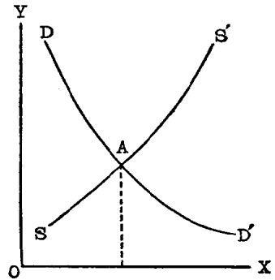

## 第一节 马歇尔庸俗经济学说概论
### 阿弗里德·马歇尔
阿弗里德·马歇尔(1842—1924年)是十九世纪末二十世纪初在资产阶级经济学界中影响最大的英国庸俗经济学家。他曾长期在英国剑桥大学当教授，因此他和他的信徒被称为剑桥学派。资产阶级经济学家还把马歇尔的庸俗经济学说看作是英国古典政治经济学的继续和更新，因此又称马歇尔为新古典学派的创始人和主要的代表。马歇尔的主要著作是《经济学原理》（1890年）直到二十世纪三十年代，这本书所宣扬的庸俗经济理论成为英国资产阶级庸俗政治经济学的基础。

十九世纪七十年代，马克思主义广泛传播，资本主义各国工人运动迅速发展，马歇尔经济学说完全是为了反对马克思主义和工人运动而出笼的。英国本来是一个先进的资本主义国家，在十九世纪七十年代前，它的经济发展程度和国际贸易在世界上都是首屈一指的。但是，在七十年代后，情况就发生了变化。从1873年到八十年代末，英国经历了长时期的经济萧条，工农业生产都处于困难的境地，英国垄断资本力图向外发展，来摆脱困境。但是，英国国外经济地位在七十年代后也发生了动摇。由于资本主义世界发展不平衡规律的作用，德国和美国的经济有了迅速的发展，在国际贸易上成为英国有力的竞争者。在七十年代之前，英国资产阶级曾经凭借其工业所处的优势地位对本国劳动群众进行欺骗。随着英国经济力量的削弱，英国垄断资本为了保障英国国内外的经济地位就极力加强对工人的剥削和掠夺，从而使工人生活大大地恶化，失业现象成为当时突出的问题。这时马克思主义在西欧工人运动中获得了伟大胜利。英国工人运动经过一个相当长时期的低潮后，又开始苏醒了。无产阶级反对资产阶级的阶级斗争有了新的发展。在此情况下，英国统治阶级迫切需要一种新的庸俗学说来为它进行辩解，马歇尔的经济学说就是适应这种需要而产生的。

### 马歇尔经济学说的特点
马歇尔是一个典型的资产阶级折衷主义者。他的经济学说是以折衷主义而著称的。我们知道在十九世纪中叶，约翰·穆勒在《政治经济学原理》中曾对十九世纪上半期流行的庸俗经济学加以折衷，来为资本主义制度作辩护。但是，到了十九世纪下半期，约翰·穆勒学说已完全失去其辩护作用。在新历史学派、奥地利学派等的攻击下，以约翰·穆勒经济学说为基础的英国旧的庸俗经济学加速了崩溃。为了适应英国垄断资产阶级新的辩护要求，马歇尔在英国传统的庸俗经济学的基础上，吸取和综合新旧各种庸俗学说，把旧的庸俗的生产费用论、供求论、节欲论和资本生产率论，同十九世纪末风靡一时的边际效用论以及社会达尔文主义，庸俗进化论等结合起来，建立了一个新的折衷的庸俗经济理论体系。在《经济学原理》第一版序言中，他供认说：“借助于我们自己时代的新著作，并且关系到我们自己时代的新问题，本书打算对旧的学说加以新的解释。”[^1]所以，马歇尔的经济学说可以说是庸俗经济学的大杂烩。

马歇尔折衷经济学说的一个特点是以心理因素为基础的。他说：“经济学是一门研究在日常生活事务中过活、活动和思考的人们的学问，但它主要是研究在人的日常生活事务方面最有力、最坚决地影响人类行为的那些动机。”[^2]英国的庸俗经济学历来是立足在边沁的功利主义基础上。马歇尔的经济学说实际上也是如此，不过他把边沁功利主义所谓的“快乐”和“痛苦”换成了“满足”和“牺牲”，认为这是人类动机的两种形式。追求“满足”促进了人类的某种经济行为；避免“牺牲”则制约人类某种经济行为。在他看来，人类的经济生活就是由这两种动机支配的。他认为，人类的动机并不象过去一些经济学家所想象的那样可以直接度量的，只有货币才可以作为衡量“满足”和“牺牲”的标准。在马歇尔经济学说中，他处处从人的心理因素出发，这种心理因素又直接用货币来衡量。马歇尔用这个手法，把经济学变成完全从属于心理学，把产生资本主义社会阶级矛盾的物质基础一笔勾销，把一切经济现象都说成是不可捉摸的心理的表现。虽然他力图摆脱过去庸俗经济学家所无法克服的困难，把心理因素用货币来表现，但他这一手法实际上更加暴露了他的庸俗体系的破绽，因为他从来也没有能够回答动机和心理为什么可以用货币来衡量。

马歇尔经济学说的另一特点是把反动的社会达尔文主义的进化论运用来分析经济问题。如上所说，马歇尔把经济问题归结为心理问题，但是他无法回避现实中所存在的各种经济问题。因此，他又伪善地认为经济学的最高目的主要是对社会问题的解决有所“贡献”。他的“贡献”就是把庸俗进化论搬到经济学领域中证明资本主义制度是不断进化的，工人生活将随着它的进化而逐渐得到改善，因此革命是完全不必要的。马歇尔的这一说法为后来的所谓福利经济学作了开端。按照他的说法，人类社会和生物界有共同之处，支配生物发展的规律也适用于人类社会。在他看来，经济学不过是“广义生物学的一部分”。生物发展只有渐变，没有飞跃，人类社会发展也是这样。马歇尔就以“自然界没有飞跃”作为《经济学原理》一书的题词。他还在该书序言中写道：“‘自然不能飞跃’这句格言，对于研究经济学的基础之书尤为适合。”[^3]马歇尔的这种进化论是公开和直接反对马克思主义的唯物辩证法的。毛主席指出：“所谓形而上学的或庸俗进化论的宇宙观，就是用孤立的、静止的和片面的观点去看世界。这种宇宙观把世界一切事物，一切事物的形态和种类，都看成是永远彼此孤立和永远不变化的。如果说有变化，也只是数量的增减和场所的变更。”[^4]马歇尔妄图以这种庸俗进化论否定社会发展中革命的飞跃，把进化说成是发展的唯一形式，其目的乃在于企图证明资本主义制度是永远不变的，英国工人阶级不要进行革命，要耐心等候英国资本主义经济的发展来改善他们的状况。

还应该指出，人类社会与生物界根本不同，因此人类社会和生物界存在着根本不同的发展规律，马歇尔极力混淆两者的根本差别，抹煞人类社会发展存在着的特殊规律，其反动目的同样在于企图说明资本主义制度是自然进化而形成，阶级剥削和统治是由自然原因造成的，不是人力所可以改变的，力图使工人阶级离开阶级斗争的道路，而俯首听命于资本家的统治。

马歇尔在把庸俗进化论搬用到经济学中时，还提出了一个所谓“连续原理”，他写道：“本书如有它自己的特点的话，那可说是在于注重对连续原理的各种应用。”[^5]什么是“连续原理”呢？马歇尔并没有给予明确的答案。但是，从他的一些例证中，可以看出，所谓连续原理不过是认为社会经济现象不能有严格的区分，它们之间存在着连续的关系。例如，“正常”价值和“市场的”价值，看起来虽然有所不同，其实很难严格区分。前者是指长时间的，后者是指短时间的，而时间本身是绝对连续的。根据这种捏造出来的“原理”，马歇尔强调各种经济现象都是互相决定的，而没有起决定作用的东西。他说：“一个经济问题的各种因素不是被看作以联锁的因果关系逐一决定的，如甲决定乙，乙决定丙，等等，而是将它们看作互相决定的。大自然的作用是复杂的：如果把这种作用说成是简单的，并设法以一系列的基本命题来阐明它，毕竟没有什么好处。”[^6]由此可以看出，马歇尔所吹嘘的“连续原理”，事实上是抹煞社会经济现象之间的本质联系和它内在起决定作用的因素，阻挡人们去探讨资本主义的各种矛盾产生的根源，即对资本主义生产关系的研究，使人们纠缠于表面现象的联系中，从而掩盖资本主义的剥削关系。

马歇尔经济学说还有一个重要的特点，即宣扬庸俗的均衡论。在他的著作中，通过“边际增量”的分析，说明价值、工资、利息等怎样由两种相反力量的作用所形成的均衡来决定的。所谓均衡，按照他的解释，就是相反力量的均势，有如处在一个盘子里的若干圆球的静止状态。马歇尔把力学观念的均衡应用到政治经济学领域中来说明价值论和分配论，同样是为达到他的辩护目的。恩格斯在《反杜林论》中早就指出：“宇宙中的每一个物质原子在每一瞬间总是处在这些运动形式的一种或另一种中，或者同时处在数种中。任何静止、任何平衡都只是相对的，只有对这种或那种确定的运动形式来说才是有意义的。”[^7]恩格斯并且指出，事物的运动和矛盾是绝对的，平衡只是相对的、有条件的。马歇尔之流却完全违反事物的客观发展规律，把静止和均衡看成是绝对的，把简单的机械运动来代替社会发展的辩证规律，试图以均衡概念来论证社会各阶级都能得到均等的最大满足和利益，阶级利益是调和的，资本主义制度是自然和稳定的。但是，资本主义现实的发展却无情地驳倒了马歇尔的反动谬论。1929年资本主义世界经济危机的爆发就宣告了马歇尔的理论的彻底破产。虽然三十年代后，马歇尔的经济学说已被他的门徒凯恩斯的庸俗理论所取代，但它对于现代资产阶级庸俗经济学仍然有着很大的影响。

## 第二节 均衡价格论
均衡价格论是马歇尔经济学说的核心和基础。在马歇尔的经济学说中，他把价格当作价值，他对价值的分析实际上只是对于价格的分析。马歇尔用价格偷换了价值，于是他就在流通领域中的供给和需求关系来说明价值的形成。所谓均衡价格就是把价值说成是由供给和需求或买卖双方所达到的均衡来决定的。不过，和旧的供求论不同，马歇尔在说明均衡价格时，吸取了边际效用论和生产费用论，用前者来说明需求变动的规律，用后者来说明供给变动的规律。为了给这种庸俗理论披上科学的外衣，他又以供给、需求和价格三者的函数关系来论证均衡价格的形成。和我们在前一章讲过的瓦尔拉的一般均衡论不同。马歇尔的均衡价格被资产阶级经济学家称为局部均衡论，即他的分析是只就一个市场中某一商品本身的某些相反力量的相互影响，孤立地说明它的价格如何变动和决定的。在这一商品以外其他相关的商品的价格既没有独立的变动，也不受这一商品价格变动的影响，从而它们对这一商品价格的决定也不产生影响。

马歇尔怎样用边际效用论来说明需求规律呢？他写道：“一个人从一物的所有量有了一定的增加而得到的那部分新增加的利益，每随着他已有的数量的增加而递减。在他要买进一件东西的时候，他刚刚被吸引购买的那一部分，可以称为他的边际购买量。因为是否值得花钱购买它，他还处于犹豫不决的边缘。他的边际购买量的效用，可以称此物对他的边际效用。”[^8]但是，边际效用只是表现购买者的愿望和主观估计，是根本无法加以衡量的。于是，马歇尔间接地用买者所愿意支付的货币数量即价格来加以衡量，把需求转化为需求价格，把“边际效用递减规律”转化为“需求价格递减规律”，并从而得出了所谓需求的一般规律，即价格低需求量多，价格高则需求量少。在《经济学原理》中，马歇尔根据他的这种需求理论，构成一个所谓需求表，用以说明一个买者在不同价格下愿意买的商品量，又以这个表的数据为基础，假定它们是一个连续数量，用图示法，把它画成一条曲线，即所谓需求曲线，用以说明这个买者对这个商品的需求。[^9]

马歇尔的需求论是完全反科学的。因为需求绝不是取决于人们的主观欲望，而是取决于国民收入的多少及其在各个阶级间的分配状况。工人需求完全取决于工资水平。马克思指出：“‘社会需要’或规定需要原则的东西，本质上要由不同阶级的相互关系和他们各自的经济地位来规定。如果一个一个列举出来，那首先就是由总剩余价值对工资的比率，其次是由剩余价值所分成的不同部分（利润，利息，地租，赋税等等）的比率来规定。”[^10]马歇尔故意回避这些决定资本主义制度下需求变动的最重要因素，而从心理因素出发，凭空捏造了需求价格递减规律的谬论，完全掩盖了资本主义制度下分配的阶级对抗性对需求所起的决定作用，掩盖了资本主义基本矛盾及其所产生的生产无限扩大和劳动群众有支付能力的消费相对狭小之间的矛盾。

马歇尔以庸俗的生产费用论来分析供给规律同样是荒谬的。和分析需求一样，马歇尔也以主观心理来分析生产费用。马歇尔把生产费用分为两个概念：实质生产费和货币生产费，前者包括种种直接劳动和种种形态的资本。但是，马歇尔所谓的劳动并不是指客观的劳动量的耗费，而是继承了杰文斯的衣钵，用生产者对劳动的主观上的感觉来衡量劳动，即指生产者对劳动在心理上的厌恶和反感。和杰文斯一样，他也采用“反效用”一词来说明这种劳动。至于说到资本，马歇尔则继承了西尼耳的节欲论来解释，不过他用“等待”一词来代替西尼耳的“节欲”一词。马歇尔所谓的“反效用”和“等待”都是心理现象，于是他又提出货币生产费这个概念，以货币作为衡量“反效用”和“等待”的尺度，并用货币生产费来说明供给价格。根据马歇尔的解释，供给和需求相反，价格高则供给多，价格低则供给少。马歇尔也根据这种谬论，构成了一个所谓供给表，又以这个表的数据画了一条供给曲线。[^11]

马歇尔完全歪曲了生产费的实质。他把劳动说成是反效用，就是把劳动变成无法衡量的心理范畴，这样也就无法区别必要劳动和剩余劳动，从而也就模糊了剩余价值的起源，掩盖了资本主义剥削的真象。同时，他宣扬生产费建立在资本家和工人的相互牺牲的基础上，竭力使人相信资本主义生产过程是建立在工人和资本家共同牺牲的合作之上，工人和资本家都共同得到了最大利益。在这种手法下，资本主义社会的阶级矛盾完全被抹煞了。事实上，在资本主义下，商品的生产费用是由不变资本和可变资本的消耗构成的。对资本家来说，生产商品所耗费的东西，是按资本消耗计算的；对社会来说，生产费用是按劳动消耗计算的。因为，资本主义的商品生产费是低于商品价值，这个差额就是资本家无偿占有的剩余价值。马歇尔的生产费用论完全掩盖了这个真相。

从需求价格和供给价格的相互关系，马歇尔得出了均衡价格。在他看来，所谓均衡价格，就是供求处于均衡时的价格。他写道：“当供求均衡时，一个单位时间内所生产的商品量可以叫做均衡产量，它的售价可以叫做均衡价格。”[^12]马歇尔以图表示，均衡价格确定在需求曲线和供给曲线的交叉点上。[^13]

马歇尔的均衡价格完全歪曲了资本主义的价值规律。马歇尔用价格来偷换价值，把价值实体和价值起源问题的研究变成了对影响价格水平的各种因素的分析。事实上，供求变动只能说明商品的市场价格如何围绕价值而上下波动，根本不能说明价值本身。相反地，价值是供求变动的基础，只有在解决价值问题之后，供求关系才能得到科学的说明。马克思科学地指出：“你们如果以为劳动和其他任何一种商品的价值归根到底仿佛是由供给和需求决定的，那你们就完全错了。供给和需求只调节着市场价格一时的变动。供给和需求可以说明为什么一种商品的市场价格会涨到它的价值以上或降到它的价值以下，但决不能说明这个价值本身。假定说，供给和需求是相互平衡，或如经济学者所说，是相互抵销的。当这两个相反的力量相等的时候，它们就互相抑制而停止发生任何一方面的作用。当供给和需求相互平衡而停止发生作用的时候，商品的市场价格就会同它的实在价值一致，就会同它的市场价格绕之变动的标准价格一致。所以在研究这个价值的本质时，我们完全不用谈供给和需求对市场价格发生的那一时的影响。”[^14]虽然马歇尔企图以调和边际效用论和生产费用论为供求论做些补充，但是也决不能改变供求决定价值的根本谬误。事实上，不先解决价值问题，就无法对需求和供给进行分析。马歇尔不过企图以反科学的均衡论来掩饰资本主义的矛盾，竭力向劳动群众灌输英国经济会自动好转的乐观信念，宣扬资本主义是最合理制度而已。

## 第三节 宣扬阶级调和的分配论
### 马歇尔分配论的特点
马歇尔在“均衡价格”论的基础上建立了宣扬阶级调和的分配论。马歇尔把分配看做是国民收入如何分割为各生产要素的份额的问题。他继承了庸俗政治经济学的传统说法，把生产要素分为劳动、资本、土地和组织(指资本家对企业的管理和监督而言)，认为国民收入一方面是这四种生产要素共同合作的结果；另一方面又是工资、利息、地租和利润的来源。分配份额的大小被看作各生产要素的价值问题。前面说过，他把价格当作价值，因此各生产要素的价值也就是它们的价格，也就是工资、利息、地租和利润。

马歇尔既然把分配看为生产要素的价格问题，因此他把分析均衡价格时采取的方法应用到各生产要素价格的分析上。和他对商品价格分析一样，他把每一个生产要素的需求和供给转化为需求价格和供给价格，又综合新旧庸俗理论来说明各生产要素的供求。他应用庸俗的边际生产来说明各生产要素的需求；他以生产费用来说明除土地外，各生产要素的供给。各生产要素的需求和供给的均衡就形成它们的价格，即工资、利息、利润。

### 马歇尔的工资、利润、利息和地租的庸俗理论
关于工资，马歇尔认为它是劳动这个生产要素的需求价格和供给价格相均衡的价格。按照马歇尔的解释，劳动的需求价格是取决于“劳动边际生产率”。他认为，在生产资料不变的情况下，劳动生产率随劳动者数量的增加而递减，最后增加的一个劳动者所提供的生产率就是“劳动边际生产率”。所谓劳动供给价格是由养活、训练和维持有效劳动的成本决定的。马歇尔的这种工资理论的反动本质就在于它掩盖了工资的实质，把工资说成是对劳动的报酬，劳动者得到了工资就得到了劳动的全部报酬，因此工人在资本主义社会里并没有受到资本家的剥削。马歇尔还利用“劳动边际生产率”谬论向工人灌输一种思想，似乎工资的提高只能靠工人提高劳动生产率，而不能靠阶级斗争。事实上，在资本主义社会里，劳动生产率提高是生产相对剩余价值的最重要方法，只是对资本家有利，工人的生活则随劳动生产率提高而愈益贫困。

关于利息，马歇尔认为利息是资本的需求价格和供给价格相均衡的价格。资本的需求价格取决资本的边际生产率；资本的供给价格取决于“等待”，也就是取决于资本家的节欲。利息即决定于这两方面的力量。马克思早就揭穿资本生产率的谬论，没有劳动，不但不能创造出新的价值，而且连资本本身的价值也不能够转移到新产品上去。至于所谓“节欲”，那也只是一种心理上的东西，它对剩余价值的产生毫不相干。马歇尔的利息论完全掩盖了剩余价值的真正来源。

关于地租，马歇尔认为土地的供给是固定的，没有生产费用，从而没有供给价格。因此，地租只受土地需求的影响而决定于土地的边际生产率。马歇尔所谓的土地边际生产率不是别的，不过是臭名远扬的“土地收益递减律”的变种。他的地租理论实际上是以这个虚构的“规律”为基础的级差地租论而已。

最后，关于利润，按照马歇尔的解释，它是对于资本家管理和组织企业的报偿。马歇尔极力宣扬资本家在生产中的作用，并且把资本家的高额利润说成是他们具有特异的天赋才能的结果。事实上，资本家并不是由于他管理生产才成为资本家，而是由于他是资本家才“管理”生产，资本家“管理”生产的活动，就是他剥削工人的活动。正如列宁所指出：“资本家所关心的是怎样为掠夺而管理，怎样借管理来掠夺。”[^15]利润是工人创造的剩余价值的转化形式，而不是什么管理和组织企业的代价。

总之，马歇尔的分配论的目的是在于掩盖资本主义的剥削性质，抹煞资产阶级社会的阶级矛盾和阶级对抗。在分配论中，他公然宣扬阶级利益调和的谬论，说什么资本家和工人的收入都随资本和劳动的生产率的提高而共同增长，资本家和工人是彼此依赖和互相结合，而工人不应进行反对资本家的斗争。他公开写道：“一般资本和一般劳动，在创造国民收益上是相互合作的，并按照它们各自的(边际)效率从国民收益中抽取报酬。它们相依互存是极其密切的；没有劳动的资本，是僵死的资本；不借助于他自己或别人的资本，则劳动者势必不能久存。哪里的劳动奋发有力，则哪里资本的报酬就高，资本的增殖也很快。由于资本和知识，西方国家的普通工人在许多方面都比以前的王公吃得好，穿得好，甚至住得也好。资本和劳动的合作，如同纺工和织工的合作一样重要。”[^16]马歇尔的这一段话彻底暴露了他的经济学说为资产阶级辩护的反动本质，但是资本主义客观发展的现实，却无情地打了这个辩护士的耳光。在资本主义国家，直到现在成百万工人还在失业，成千万人在饥饿线上挣扎，资产阶级历来是不顾劳动群众的死活，为了追求高额利润，对工人和劳动群众进行残酷的剥削和压迫。因此，所谓劳动和资本是相互依赖和相互合作等等，纯粹是马歇尔之流妄图欺骗劳动群众的反动伎俩。

## 第四节 马歇尔对垄断资本的辩护
马歇尔把它的经济学说的全部分析归结为在资本主义社会中各个阶级都可以获得“最大满足”；而“最大满足”又依存于自由交换条件下供给和需求的均衡。作为一个自居为英国资产阶级经济学正统的继承者，马歇尔不能不以“经济自由主义”为标榜。但是，马歇尔活动时期，正是资本主义向帝国主义过渡时期，如何对待垄断组织是经济理论和经济政策的首要课题。在原则上，马歇尔所贩卖的以自由交换为条件的“最大满足”的理论是和垄断组织不相容的。但是，作为资产阶级的忠实辩护士，他不但想方设法弥补他的理论上的这一漏洞，而且极力掩盖垄断组织的本质，为垄断资本进行辩护。

继《经济学原理》之后，马歇尔于1919年发表了《工业和贸易》一书。在这本书中，马歇尔为垄断组织辩护提供“理论”和现实的根据。他把工业组织区分为竞争和垄断，但是他强调二者之间并不存在一条明显的界线。他写道：“虽然在理论上，垄断和自由竞争是完全区别开的，但是在实际上它们以不易觉察的程度，相互贯穿渗透。在几乎一切竞争的企业里，存在着垄断的因素；而一切现代有实际意义的垄断都是以不稳定的情况下保持它们的权力；它们很快就会失去这权力，如果它们忽略了直接和间接的可能性。”[^17]马歇尔的这一观点成为后来资产阶级关于垄断竞争学说的出发点。在这里，马歇尔把垄断和竞争的差别看作只是一个程度的差别，抹杀垄断的本质。同时，他在比较垄断价格和竞争价格时，又宣扬垄断的形成对消费者有利。在他看来，因为垄断企业的生产能力很高，具有大生产的优越性，成本更低，商品的价格比自由竞争的商品的供给价格要低。马歇尔又认为在垄断状态下，垄断者还可以自由调整其商品的供给状态，使它适应市场的需求。马歇尔的这些说法，避而不谈垄断资本为了追求垄断高额利润而残酷剥削劳动群众这一根本事实，而极力为垄断资本涂脂抹粉，进行粉饰。至于说什么垄断可以调整商品供给使其和需求相适应，以及垄断组织具有较大生产力对社会有利等等，更是纯粹谎话。列宁科学地指出，在帝国主义下，“生产社会化了，但是占有仍然是私人的。社会化了的生产资料仍旧是少数人的私有财产。表面上大家公认的自由竞争的一般架子依然存在，但是少数垄断者对其余居民的压迫更加百倍地沉重、显著和令人难以忍受了。”[^18]列宁还科学地论证了垄断资本为了在世界市场上竞争，可能用改良技术的办法来降低生产成本和提高利润，但是垄断所特有的停滞和腐朽的趋势日趋加深，从而阻碍社会生产力发展。马歇尔的谬论完全抹杀了垄断资本的这种本质。

虽然马歇尔以混同竞争和垄断之间差别的手法，装做宣扬经济自由，并以自由竞争作为他的“理论”分析的前提，但是实际上他所说的竞争并不是完全自由的竞争而是带有垄断因素的自由竞争，同时他表面上表示反对垄断，但是他所反对只是所谓纯粹垄断，而这种垄断按照他的说法几乎是不存在。总之，马歇尔在竞争和垄断关系做了很多文章，不过为了歪曲两者之间的辩证关系，为垄断进行辩护。列宁指出：“从自由竞争中成长起来的垄断并不消除竞争，而是凌驾于竞争之上，与之并存，因而产生许多特别尖锐特别剧烈的矛盾、摩擦和冲突。垄断是从资本主义向更高级的制度的过渡。”[^19]

马歇尔对当时德国和美国资本主义发展已经严重威胁着英国的经济地位的状况，感到深切的关注。他力图证明反对和限制垄断的经济政策对英国经济是不利的，说什么“英国人具有节制和坚韧不拔的特点”，使得“竞争和垄断的弊端保持具有相当狭窄的范围内”。[^20]我们知道，英国帝国主义完全是在剥削和奴役本国人民和殖民地人民的基础上发展起来的，但是马歇尔却宣扬是英国人所具有的特殊品质，使英国在世界上工业占垄断地位。马歇尔为英国垄断资本辩护的意图，至此更昭然若揭了。

[^1]: 马歇尔：《经济学原理》上册，商务印书馆1964年版，第11页。

[^2]: 马歇尔：《经济学原理》上册，商务印书馆1964年版，第34页。

[^3]: 马歇尔：《经济学原理》上册，商务印书馆1964年版，第18页。

[^4]: 毛泽东：《矛盾论》。《毛泽东选集》，第275页。

[^5]: 马歇尔：《经济学原理》上册，商务印书馆1964年版，第12页。

[^6]: 马歇尔：《经济学原理》上册，商务印书馆1964年版，第15页。

[^7]: 恩格斯：《反杜林论》，人民出版社1971年版，第56—57页。

[^8]: 马歇尔：《经济学原理》上册，商务印书馆1964年版，第112页。

[^9]: 参阅马歇尔：《经济学原理》上册，商务印书馆1964年版，第115页注3附。

[^10]: 马克思：《资本论》第3卷，人民出版社1966年版，第189页。

[^11]: 参阅马歇尔：《经济学原理》下册，商务印书馆1964年版，第35—36页注3附。

[^12]: 马歇尔：《经济学原理》下册，商务印书馆1964年，第37页。

[^13]: 参阅马歇尔《经济学原理》下册，商务印书馆1964年版，第38页。左表表示需求和供给的均衡。$\mathbf{OY}$代表价格，$\mathbf{OX}$代表商品数量， $\mathbf{DD^{\prime}}$ 代表需求曲线， $\mathbf{SS^{\prime}}$ 代表供给曲线。$\mathbf{A}$表示需求和供给的均衡点。这个均衡点即决定商品的均衡价格。

[^14]: 马克思：《工资、价格和利润》。《马克思恩格斯全集》第16卷，第131页。

[^15]: 列宁：《怎样组织竞赛》。《列宁全集》第26卷，第383页。

[^16]: 马歇尔：《经济学原理》下册，商务印书馆1964年版，第215页。

[^17]: 马歇尔：《工业和贸易》1927年英文版，第397页。

[^18]: 列宁：《帝国主义是资本主义的最高阶段》，人民出版社1971年版，第21页。

[^19]: 同上书，第79—80页。

[^20]: 马歇尔：《工业和贸易》，1927年英文版，第582—583页。