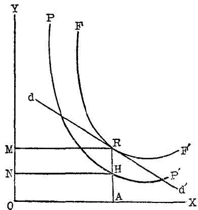
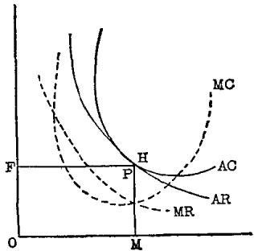

## 第一节 垄断经济学——垄断资本主义的产物
十九世纪末二十世纪初，资本主义从自由竞争阶段发展到了垄断阶段，即帝国主义阶段。正如毛主席所指出的：“自由竞争时代的资本主义发展为帝国主义，这时，无产阶级和资产阶级这两个根本矛盾着的阶级的性质和这个社会的资本主义的本质，并没有变化；但是，两阶级的矛盾激化了，独占资本和自由资本之间的矛盾发生了，宗主国和殖民地的矛盾激化了，各资本主义国家间的矛盾即由各国发展不平衡的状态而引起的矛盾特别尖锐地表现出来了，因此形成了资本主义的特殊阶段，形成了帝国主义阶段。”[^1]

列宁的光辉著作《帝国主义是资本主义的最高阶段》一书，揭示了垄断资本主义的本质和基本特征，作出了“帝国主义是无产阶级社会革命的前夜”[^2]的科学结论。列宁的伟大理论提高了无产阶级的革命觉悟，武装了无产阶级的先锋队——共产党。列宁领导的俄国伟大的十月社会主义革命震撼着整个资本主义世界。

在这种情况下，为了维护垄断统治，为了麻痹无产阶级的革命意志，为了对抗列宁的帝国主义学说，垄断资产阶级迫切需要制造直接为垄断辩护的经济理论。1926年12月，英国资产阶级经济学家斯拉发在《经济学杂志》上发表了《竞争条件下的报酬规律》一文，公开声言：“有必要放弃自由竞争的道路，而转向相反的方向，即转向垄断。”经过一个酝酿和编造的过程，旨在为垄断辩护的垄断经济学终于粉墨登场。

美国资产阶级经济学家张伯仑和英国资产阶级经济学家罗宾逊，继承了马歇尔的庸俗传统，编造了一套垄断经济学——垄断竞争(不完全竞争)论。1933年，张伯仑和罗宾逊分别出版了《垄断竞争理论》和《不完全竞争经济学》。这两本书被认为是垄断经济学的代表作，张伯仑和罗宾逊被认为是垄断经济学的权威。

跟张伯仑、罗宾逊的垄断经济学不同，美国资产阶级经济学家加耳布雷思继承了凡勃仑的庸俗传统，在五十年代和六十年代，先后编造了另一套垄断经济学——抗衡力量论和结构改革论。说什么由于出现了“抗衡力量”，由于垄断企业的“权力转移到了‘技术结构阶层’手中”，因而垄断资本主义发生了质的变化，不再是垄断资本主义了。加耳布雷思宣传抗衡力量论的主要著作是《美国资本主义：抗衡力量的概念》，宣传结构改革论的主要著作是《新工业国》。

垄断经济学都以研究垄断为名，行歪曲垄断之实。它们妄图把垄断同托拉斯分开，把垄断同帝国主义分开，宣扬垄断的“优越性”，宣扬垄断的危害已被“抗衡力量”所抵销，宣扬垄断组织由于发生了“结构改革”，因而改变了资本主义性质。可见，垄断经济学完全是为垄断资本主义辩护的资产阶级庸俗政治经济学。

下面我们分别以张伯仑和罗宾逊的垄断竞争(不完全竞争)论和加耳布雷思的抗衡力量论为代表，来看看垄断经济学的反动实质。

## 第二节 垄断竞争(不完全竞争)论
垄断竞争(不完全竞争)论，是垄断经济学的一个重要组成部分。这种理论的创始者是张伯仑[^3]和罗宾逊[^4]。张伯仑把自己的理论叫作“垄断竞争理论”，罗宾逊把自己的理论叫作“不完全竞争经济学”，并且他们两人还为名称问题煞有介事地争论不休。其实，二者没有实质区别。

### 垄断和竞争
什么是垄断？垄断和竞争是什么关系？张伯仑和罗宾逊首先在这个问题上施展他们的辩护伎俩。

张伯仑认为，垄断者或垄断厂商是一种商品唯一的卖者，他能控制产品的销售数量从而控制价格。没有垄断因素的竞争是完全竞争，也就是没有一个竞争者或竞争厂商能够控制商品的销售数量从而控制价格的竞争。

罗宾逊认为，纯粹垄断和纯粹竞争是两个“极端”现象，“给垄断者下一个逻辑定义的任何企图会把垄断或竞争逐出研究范围之外”。[^5]她断言：在现实经济生活中，完全垄断这种现象是不存在的。

张伯仑和罗宾逊都企图把垄断和竞争说成是罕见现象，企图以此来抹煞自由竞争时代的资本主义和垄断时代的资本主义之间的区别和联系，否定垄断统治在帝国主义时代是普遍现象，否定垄断是帝国主义的经济基础。

在帝国主义时代，垄断不可能消灭竞争，而是使竞争更为尖锐和剧烈。张伯仑和罗宾逊对这种现象竭力加以歪曲，说是资本主义市场的普遍情况既不是完全竞争，也不是垄断，而是什么垄断和竞争的“混合”。张伯仑把这种所谓“混合”叫作垄断竞争，罗宾逊则把它叫作不完全竞争。在这里，张伯仑和罗宾逊玩弄折衷主义的手法，竭力否认垄断的存在，否认垄断是现代资本主义的典型现象。

### 产品差别论
垄断是怎样造成的？为什么垄断和竞争的“混合”才是资本主义的普遍情况？张伯仑宣称，产品差别是造成垄断的一个决定性因素，但在一定程度上又要受到不完全代替品的竞争，因而使垄断和竞争相“混合”。他写道：“如有差别则垄断发生，差别的程度越大，垄断的因素也越大。盖产品如有任何程度的差别，即可说该售卖者对他自己的产品拥有绝对的垄断，但却要或多或少遭受到不完全代替品的竞争。这样则每人都是垄断者，而同时也是竞争者，我们可以称他们为‘竞争的垄断者’，而称这种力量为‘垄断竞争’特别相宜。”[^6]

张伯仑的产品差别是一个十分庸俗的概念。按照他的说法，“以任何一种明显的标准来区分一个售卖者和另一个售卖者的货物(或劳务)，一般说来产品都是有其差别的。”[^7]他解释说，这种标准可能是具体的，也可能是想象的。“它的‘不同’可能是由于产品本身品质上的改变——如技术的改变，新的式样，或原料较好等；它也可能是由于新的包装或装潢等；也可能是由于服务的迅速或有礼貌，做生意的方法与众不同，或地点不同等。有些不同的情形是很明确而具体——例如采用新颖的式样。但有些情形，如服务性质的不同，则是不大显著，甚至是意识不到的。”[^8]总之，按照张伯仑的定义和说明，资本主义市场上的一切商品都是有差别的，正是这种差别造成了垄断，因此，这些有差别的商品的生产者和销售者全是垄断者。

罗宾逊没有象张伯仑那样提出一套系统的产品差别论，但是在对垄断的看法上，她和张伯仑的上述观点实质上也是一样的。她说：“所谓的‘垄断’的全部含义是，个别生产者的产品在各方面恰巧被一系列代替品中的一个显著的差别所限制。”

张伯仑、罗宾逊之流把所有的商品生产者和销售者都说成是垄断者，这具有明显的辩护性。因为大家都是垄断者，也就没有垄断者了。这就根本抹煞了垄断的存在，从而根本否定了垄断资本主义，掩盖和抹煞了帝国主义的本质和基本特征。要知道，自由竞争必然引起生产集中，生产高度集中的结果必然引起垄断，这是资本主义发展的必然规律。张伯仑之流闭口不谈产生垄断的这一根本原因，而是胡扯什么每个生产者或销售者都是自己的商品的垄断者。这不能不暴露出他们的垄断资本辩护士的面目。

张伯仑所说的产品差别是一个超历史的概念，由产品差别而产生的垄断也是一个超历史的概念。按照他的产品差别论，简单商品生产和资本主义商品生产，自由竞争时代的商品生产和帝国主义时代的商品生产，性质都一样，都是垄断。这就否定了垄断的历史性，否定了垄断资本主义是资本主义的一个特定历史阶段。

产品差别论者玩弄差别这个字眼，其真实用心乃在于用非本质差别掩盖和抹煞本质差别。就客观事物的差异而论，世界上没有任何两种完全相同的东西。但是，要认识事物的本质属性，就必须区分本质差别和非本质差别。张伯仑所搜罗的什么专利权、商标、商店招牌、包装等，不过是资本主义经济生活中一些最肤浅的经济现象，是些非本质的差别。至于什么消费者的鉴赏力、偏好、想象力或销售者的服务态度等，本来就不是商品自身所具有的属性，又怎么能说这些也是产品差别呢!

产品差别论丝毫经不起历史和现实的检验。在资本主义经济史上，从自由竞争到垄断，从垄断的形成到垄断统治的不断加强，产品差别不是越来越大，而是有越来越小的趋势。特别是垄断企业，往往生产标准化的产品。而标准化产品的增多，正意味着产品差别的缩小。在资本主义现实的经济生活中，产品差别相对说来比较大的部门，例如缝纫业，垄断程度却比较低。而产品差别相对说来比较小的部门，例如钢铁、石油、铝、电力、水泥等部门，垄断程度却非常高。历史和现实都有力地证明，张伯仑的所谓“有差别则垄断发生，差别的程度越大，垄断的因素也就越大”的说法，全是谬论。

张伯仑的产品差别论不仅企图否认垄断的真正原因，从而否定帝国主义的本质和基本特征，而且企图混淆垄断组织和非垄断组织的界限，特别是混淆垄断企业和中小企业的界限，以便掩盖和抹煞它们之间的矛盾。按照产品差别论，既然商号、商标、包装、设计、颜色、式样、商店地址、生意经、服务态度等都可导致垄断，那末，在美国，象美国钢铁公司、伯利恒钢铁公司等垄断巨头的大企业，同中小企业就没有区别了，甚至同街头巷尾的小杂货店也没有区别了。它们不分彼此地都成了垄断企业了。难怪有的资产阶级经济学家都说：“关于垄断竞争的经典著作（指张伯仑之流的著作——引者注）给读者造成的印象是，我们社会面临的垄断问题，主要不是由大的钢铁公司造成的，而是由小的街头杂货商人造成的。”[^9]

### 垄断竞争价值论
产品差别论是张伯仑的垄断竞争价值论的基础。按照张伯仑的说法，在卖者或厂商很多而又存在产品差别的情况下，就会出现垄断竞争。垄断竞争条件下的卖者或厂商的商品销售数量，受到价格、产品性质和销售开支三个因素的影响，销售数量同价格、产品性质、销售开支之间存在着所谓均衡关系。张伯仑把这种所谓均衡关系分为单个厂商的均衡和全行业厂商的均衡。他称前者为个人均衡，后者为集体均衡；前者的价格为个人均衡价格，后者的价格为集体均衡价格。

张伯仑的垄断竞争价值论的起点是用产品差别来说明个人均衡，接着加入部门内各厂商的相互关系来说明集体均衡，然后再加入销售开支来说明个人均衡和集体均衡。张伯仑求助于繁琐哲学，玩弄使上述三个因素变动和不变动的手法，构成许多所谓均衡情况，弄得十分复杂。在这一系列的均衡中，使产品性质和销售开支两个因素不变动而使价格这个因素变动的情况下的集体均衡，被认为是他的垄断竞争价值论的代表。右面就是这种垄断竞争价值论的图形。[^10]

图中$\mathbf{OA}$为产量，$\mathbf{AR}$为价格，$\mathbf{AH}$为单位生产成本，$\mathbf{HR}$为单位销售成本；$\mathbf{OAHN}$为总生产成本，$\mathbf{NHRM}$为总销售成本，$\mathbf{OARM}$为总综合成本。

图中$\mathbf{PP^{\prime}}$为垄断竞争厂商的生产成本曲线，加上用于销售的开支，便是生产和销售的综合成本曲线$\mathbf{FF^{\prime}}$。$\mathbf{PP^{\prime}}$和$\mathbf{FF^{\prime}}$两条曲线都先降后升，呈$\mathbf{U}$形。据说原因是，起初由于大规模生产的经济效果而下降，后来又由于什么收益递减规律的作用而上升。

图中dd'为需求曲线，也就是该厂商的平均收益曲线。平均收益是出卖单位商品所得到的收益，即单位商品的卖价。平均收益随销售数量增加而下降，曲线向右下方倾斜。据说原因是，由于什么产品差别，厂商可以控制自己的商品的价格。

如果$\mathbf{dd}'$的位置较高，同$\mathbf{F}\mathbf{F}^{\prime}$相交，这意味着用于生产和销售的综合成本小于单位产品的卖价(平均收益)，厂商便会获得超额利润。这时，其他部门的一些厂商就会进入这一部门，竞争结果会使$\mathbf{dd}'$下降。

如果$\mathbf{dd}'$的位置较低，完全处于$\mathbf{FF}'$之下，同$\mathbf{FF}'$不交不切，这意味着用于生产和销售的综合成本大于单位产品的卖价(平均收益)，厂商便会遭受亏损。这时，本部门的一些厂商就会退出这一部门，竞争结果会使$\mathbf{dd}'$上升。

厂商长期竞争的结果，使生产和销售的综合成本曲线$\mathbf{F}\mathbf{F}^{\prime}$同平均收益曲线$\mathbf{dd'}$相切于$\mathbf{R}$点。在这一点上，超额利润和亏损都不复存在。这个切点，便是厂商的长期均衡状态。这时商品的卖价等于它的平均成本。也就是说，切点决定了垄断竞争厂商的价格和产量。在这个均衡点上，垄断竞争厂商的价格，一方面等于消费者愿意支付的价格，另一方面等于该厂商的生产和销售的综合成本。在这种情况下，厂商只能获得“正常利润”。因为按照张伯仑的定义，“正常利润”包括在平均成本之中。

张伯仑使用大量的术语和一系列的几何图形，对垄断竞争价值论作了十分繁琐的“论证”，其最终结论不过是一句话：垄断资本家的商品卖价等于它的平均成本，没有垄断利润。

罗宾逊的不完全竞争价值论，也与此类似。[^11]

张伯仑自我吹嘘，说他确定了“价值理论的新方向”。罗宾逊也自命不凡，说她提供了“价值分析的新工具”。实际上，垄断竞争（不完全竞争）价值论不过是庸俗透顶的资产阶级旧货色的花样翻新。诸如均衡论、供求论、生产要素论、收益递减规律、边际观念等破烂，都被他们拣来用于完成为垄断价格和垄断利润辩护的新任务。

否认垄断价格和垄断利润是垄断资本主义的普遍现象，这是垄断竞争(不完全竞争)价值论的辩护性的集中表现。按照张伯仑、罗宾逊的谬论，在长期均衡的情况下，由于卖价等于平均成本（包括所谓“正常利润”），所以垄断组织只能获得平均利润，而没有垄断利润。在这里，张伯仑之流为垄断辩护的意图是很清楚的。

垄断竞争价值论的编造者企图用被他们庸俗地歪曲了的生产价格和平均利润，来偷换垄断价格和垄断利润，以便达到为垄断辩护的目的。这种做法，当然是徒劳的。诚然，在自由竞争时代，由于参加竞争的企业很多，一个或几个资本主义企业想长期保持高价是不可能的，竞争会迫使资本家按生产价格出售商品，也就是按照相当于成本加平均利润的价格出售商品。但是，当自由竞争发展到垄断之后，由于巨大的资本主义企业或企业的联合垄断了某种或某些商品的绝大部分的生产和销售，便可以规定垄断价格。这时，垄断组织的商品不是按照生产价格出售，而是按照大大高于生产价格的垄断价格出售。垄断组织获得的不是平均利润，而是大大高于平均利润的垄断利润。这种垄断利润是靠剥削本国大多数居民、掠夺殖民地和附属国人民、以及战争和国民经济军事化的办法获得的。垄断组织凭借垄断价格所得到的那部分价值，正是无产阶级和其他劳动人民、殖民地和附属国人民、以及中小资本家所失去的。它反映了垄断资产阶级同无产阶级和其他劳动人民之间日益激化的矛盾，反映了宗主国和殖民地之间日益激化的矛盾，也反映了垄断资本和自由资本之间的矛盾。张伯仑之流不顾事实，硬说商品不是按照垄断价格而是按照什么包括“正常利润”在内的生产和销售的综合成本价格出售，正是为了掩盖垄断利润的来源和实质，掩盖它所体现的尖锐的阶级对抗关系。

张伯仑大概也知道，否定垄断价格的存在是一项很困难的辩护任务。因为生活在垄断统治下的广大劳动群众，无需懂得“高深的”经济理论和“渊博的”经济史或价格史知识，只凭日常购买生活必需品的经验，就不会轻信垄断辩护士的胡说八道。所以，张伯仑又不得不承认“垄断竞争厂商”的商品价格高于“完全竞争厂商”的商品价格。但是，他时刻不忘自己为垄断组织辩护的任务，马上又玩弄他的产品差别论，否定垄断组织可以规定垄断价格，硬说这是产品差别增加了销售开支的结果。在上面的图形中，生产和销售的综合成本曲线$\mathbf{F}\mathbf{F}^{\prime}$高于生产成本曲线$\mathbf{P}\mathbf{P}^{\prime}$，就是因为加进了销售开支。张伯仑的这种辩护手法，其实也很拙劣。纯粹流通费用的增长，只能证明垄断统治下浪费的增长，这是资本主义腐朽性的一种表现。纯粹流通费用不能给商品附加任何价值，根本不能用来说明价格的形成，因而也不能用来说明垄断价格的形成。

## 第三节 抗衡力量论
上述的垄断竞争（不完全竞争）论，是在三十年代初出笼的。这种谬论否认生产和资本的集中是垄断形成的决定性条件，硬说垄断的形成同企业的大小无关，甚至荒谬地断言小企业也能形成垄断。垄断资本主义发展的历史事实完全驳斥了这种谬论。从三十年代以来，帝国主义国家的社会生产和资本越来越集中在少数大垄断资本家手中，企业规模不断增大，垄断程度不断提高。在这种垄断统治日益加强的情况下，一些资产阶级经济学家认为，垄断争论只分析了具有产品差别的许多卖者之间的竞争，而没有着重说明销售者或生产者人数很少的那种市场类型。因此，他们感到只靠垄断竞争论来为垄断辩护，已难于达到欺骗劳动群众的目的。于是，从四十年代起，他们集中力量为少数大企业控制许多商品绝大部分的生产和销售的现象进行辩解。

在现代的一些资产阶级经济学教科书中，资本主义市场一般被分为四种类型：完全竞争、垄断、垄断竞争和寡头。[^12]据解释，完全竞争市场是指厂商很多而且没有产品差别的市场，垄断市场是指只有一个厂商的市场，垄断竞争市场是指厂商很多但是具有产品差别的市场，寡头市场是指只有少数几个厂商的市场。寡头又被分为两种：没有产品差别的寡头和有产品差别的寡头。在四十年代和五十年代，资产阶级经济学家编造了种种寡头垄断论或寡头竞争论，诸如克拉克的“有效竞争论”、加耳布雷思的“抗衡力量论”、包尔丁的“组织革命论”，等等，都属于这类货色。

现在，我们以加耳布雷思[^13]的抗衡力量论为例，来看看现代资产阶级经济学家的寡头理论的实质。

加耳布雷思认为，在现代资本主义市场中，占统治地位的是为数不多的销售者的典型市场，即寡头市场。这种寡头市场具有一定程度的垄断权力，能够控制价格，从而获得一定程度的垄断利润。但是，加耳布雷思口头上承认这些，是为了从根本上否认这些。他的辩护逻辑是这样的：寡头由于具有一定程度的垄断权力，因而能获得一定程度的垄断利润，这就会损害他人的利益。受损害的买者（例如消费者）或卖者（例如劳动者）为了保护自己免受损害，便发展一种抗衡力量，也就是组织反击性的议价力量，箝制、抵销、中和寡头的垄断权力，并分享寡头的一部分垄断利润。

关于这种所谓抗衡力量，加耳布雷思这样写道：“事实上，出现了代替竞争的对私人力量的新的限制。它们是由削弱和破坏竞争的同一个集中过程造成的。但是，它们不是出现在市场的同一方，而是出现在市场的另一方；不是出现在竞争者当中，而是出现在消费者或卖者当中。如果要适当地给这种竞争的对立物起一个名字，那我就称之为抗衡力量。”[^14]按照加耳布雷思的解释，在竞争的市场上，竞争力量出现在市场的同一方，也就是说，竞争发生在卖者和卖者之间，或者发生在买者和买者之间。但是，与此不同，抗衡力量出现在市场的另一方，是买者同卖者之间的抗衡；或者是弱小的买者同强大的卖者之间的抗衡，或者是弱小的卖者同强大的买者之间的抗衡。前者如消费者要求零售商为消费者的利益而发展的抗衡，其表现形式是组织联锁商店；后者如劳动者发展的抗衡力量，其表现形式是组织工会。加耳布雷思说，联锁商店能使消费者买到低于市场价格的商品，工会能使工人通过议价能力的较量同资方分享利润。

加耳布雷思的实际结论是：抗衡力量成了垄断资本主义的自动调节经济的力量，“抗衡力量的增长使自动调节经济的力量得到加强”。这样，生产集中不仅没有引起垄断，而且给消费者和劳动者带来了利益。由于抗衡力量的出现，垄断就不再成为问题了。

以上这些，就是加耳布雷思的抗衡力量论的基本论点。

加耳布雷思编造的这个抗衡力量论，是为垄断资本辩护的，它同垄断资本主义的现实经济生活毫无共同之点。

生产集中究竟导致了什么？是否导致垄断？历史雄辩地证明了列宁的科学论断：集中发展到一定阶段，就自然而然地走到垄断。抗衡力量论不仅否认了现代资本主义大企业和大企业联合的垄断性质，也否认垄断资本主义条件下存在着激烈的竞争。按照加耳布雷思的说法，生产集中就是意味着削弱和破坏了竞争。加耳布雷思还说什么“在马克思主义的词汇中，垄断和竞争是互相排斥的。”[^15]这不仅暴露了他对马克思主义一窍不通，更重要的是暴露了他竭力歪曲马克思主义，以便否认垄断以及与之并存的竞争的反动意图。事实上，垄断并不排除竞争，相反，它使竞争更加尖锐化和复杂化。马克思早就指出：“垄断产生着竞争，竞争产生着垄断。垄断资本家彼此竞争着，竞争者逐渐变成垄断资本家。”[^16]马克思的这一原理，对资本主义的垄断阶段是完全适用的。列宁进一步指出：“正是竞争和垄断这两个互相矛盾的‘原则’的结合才是帝国主义的本质，正是这种结合在造成崩溃，即造成社会主义革命。”[^17]

加耳布雷思硬说在流通领域内存在着抗衡力量。既然如此，那我们就不妨来看看这个领域究竟是什么情况。

先看看生产资料市场。加耳布雷思认为，在生产资料销售市场上，厂商的数目虽然不多，但作为买主的大公司籍制了作为卖主的大公司的权力，相当正常地运用了抗衡力量。这是对事实的极大歪曲。实际上，任何一个部门的托拉斯在市场上都是既作为卖主又作为买主出现的。作为卖主的垄断组织和作为买主的垄断组织之间的竞争，是常见的部门间竞争的一种形式。前者力图提高其供应的商品价格，后者则力图降低这种商品价格，从而展开了激烈的斗争。例如，当美国钢铁公司提高钢价时，福特汽车公司便同它展开尖锐复杂的斗争，直至自行建立钢厂。斗争的双方都是垄断组织，斗争的性质只不过是垄断组织的部门间竞争。这是不同部门的垄断组织之间存在着利害冲突的一种表现，丝毫也不意味着福特汽车公司籍制、抵销、中和了美国钢铁公司的垄断权力。

再看看消费品市场。加耳布雷思说，在消费品销售市场上，消费者虽然自己并不组织抗衡力量，但是他们要求零售商为消费者的利益去发展抗衡力量。加耳布雷思把美国的食品联锁商店、百货联锁商店等说成是消费品市场上抗衡力量的表现。这也是对事实真相的歪曲。加耳布雷思所说的零售联锁商店，正是垄断组织垄断商品销售所采取和利用的形式之一。为了控制市场，操纵物价，排挤竞争对手，垄断组织虽然会通过批发价格适当地给参加联锁商店的零售商以某些好处，但是广大消费者始终是垄断价格的直接受害者。

最后看看劳动力市场。加耳布雷思认为，在劳动力市场上，垄断组织是强大的买者，工人是弱小的卖者，工会则是调和垄断组织和工人之间利害冲突的抗衡力量。他还进一步认为，工人组织抗衡力量的目的不仅是为了保护自己，而且是为了分享垄断利润。这是弥天大谎。加耳布雷思编造这一谎言的反动目的在于：一方面，攻击工人阶级，攻击工会，胡说什么工人分享了利润，以便为垄断组织规定垄断价格和攫取垄断利润制造口实；另一方面，安图在工人群众中制造幻想，似乎不用政治斗争，不用暴力革命，只要通过工会进行经济斗争，就能改变工人的地位。当然，加耳布雷思的这种狂妄企图肯定是要落空的。在垄断统治下，工人不仅在生产领域中而且在流通领域中遭受垄断资本的双重剥削。工人群众为了阻止自己生活水平的下降，通过工会同垄断组织进行了斗争。这种斗争在某些情况下虽能暂时阻止生活水平的继续下降，但它不可能根本改变无产阶级的地位，不可能改变无产阶级贫困化的命运。暂时提高的名义工资又会由于通货膨胀、物价上涨和税收增加而化为乌有。经济斗争对于无产阶级虽然具有重要意义，但是这种斗争只是反对资本主义的后果，而不是反对产生这种后果的原因。无产阶级只有把经济斗争发展为政治斗争，通过暴力革命推翻资产阶级政权，用无产阶级专政代替资产阶级专政，用社会主义制度代替资本主义制度，才能摆脱垄断资本的残酷剥削和压迫，得到彻底解放。

从以上可以看到，加耳布雷思的抗衡力量论完全是为垄断辩护的谬论。他维护垄断统治的立场在对待国家职能问题和反托拉斯法上表现得尤为明显。加耳布雷思宣称，帝国主义国家的主要职能就是支持抗衡力量的发展。他写道：“国家保证帮助发展抗衡力量成了国家的主要职能，也许成了国家在国内生活中最主要的职业”。加耳布雷思公然反对反托拉斯法，他说：“反托拉斯法不加选择地被用来反对那些已经在市场上建立起抗衡力量的公司。”事实上，帝国主义国家是垄断资产阶级压迫无产阶级和广大人民群众的工具，它的阶级本性决定了它根本不可能帮助消费者和劳动者去发展什么抗衡力量。加耳布雷思在国家帮助发展抗衡力量的幌子下，实际上是主张国家支持垄断组织，加强垄断统治。这就不难理解，为什么口头上不赞成垄断的加耳布雷思，却坚决反对反托拉斯法。美国和其他一些帝国主义国家的反托拉斯法本来就是一纸空文，可是就连这个虚伪的、无效的反托拉斯法，加耳布雷思也加以反对，唯恐它有可能损害垄断组织的利益。在这里，加耳布雷思效忠于垄断资本的立场更加暴露无遗。

[^1]: 毛泽东：《矛盾论》。《毛泽东选集》，第289页。

[^2]: 列宁：《〈帝国主义是资本主义的最高阶段〉法文版和德文版序言》。《列宁全集》第22卷，第186页。

[^3]: 张伯仑，爱德华(1899年一)，美国现代资产阶级经济学家，曾任哈佛大学经济学教授。主要著作有：《垄断竞争理论》、《走向更一般的价值论》等。

[^4]: 罗宾逊, 乔安(1903年一), 英国现代资产阶级经济学家, 所谓“左派”凯恩斯主义者, 剑桥大学教授, 皇家经济学会副会长。主要著作有: 《不完全竞争经济学》、《论马克思主义经济学》、《资本积累论》、《论经济成长论》等。

[^5]: 罗宾逊：《不完全竞争经济学》，商务印书馆1961年版，第5页。

[^6]: 张伯仑：《垄断竞争理论》，三联书店1958年版，第7页。

[^7]: 同上书，第55页。

[^8]: 张伯仑：《垄断竞争理论》，三联书店1958年版，第70—71页。

[^9]: 鲁斯希尔德：《价格理论与寡头》。载美国经济学会编：《价格理论研究》，1953年英文版，第444页。

[^10]: 张伯仑：《垄断竞争理论》，三联书店1958年版，第154页。

[^11]: 罗宾逊认为：“如果竞争是不完全的，则个别企业的产品需求曲线（即所谓平均收益曲线AR——引者)是下降的(如图), 而均衡的两个条件(指所谓边际收益MR等于边际成本MC, 以及平均收益AR等于平均成本AC——引者)只能在那些平均成本下降的产量上得到满足。”“只有当需求曲线是平均成本曲线的切线时, 利润才将是正常利润。”(罗宾逊:《不完全竞争经济学》, 商务印书馆1961年版, 第85,82页)

[^12]: 斯托尼尔与黑格合著：《经济理论教科书》，1964年英文版，第182—209页；萨缪尔逊：《经济学》，1961年英文版，第515—520页。

[^13]: 加耳布雷思, 约翰·肯尼斯(1908年一), 出生于加拿大的美国现代资产阶级经济学家, 哈佛大学经济学教授。曾任美国物价管理局副局长、美国国务院经济安全政策室主任、美国驻印度大使、《幸福》杂志编委等职。1972年任美国经济学协会会长。主要著作有: 《美国资本主义: 抗衡力量的概念》、《丰裕社会》、《新工业国》、《经济学与公共目的》等。

[^14]: 加耳布雷思：《美国资本主义：抗衡力量的概念》，1956年英文版，第111页。

[^15]: 加耳布雷思：《美国资本主义：抗衡力量的概念》，1952年英文版，第174页。

[^16]: 马克思：《哲学的贫困》。《马克思恩格斯全集》第4卷，第178页。

[^17]: 列宁：《修改党纲的材料》。《列宁全集》第24卷，第431—432页。