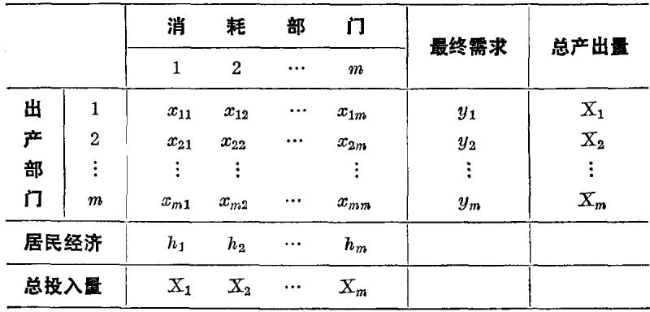

## 第一节 经济计量学概述
经济计量学是现代资产阶级政治经济学的一个流派。和其他流派一样，也是适应垄断资本的需要而产生的。

经济计量学一词，是挪威资产阶级经济学家弗瑞希于1926年首先使用的。1930年，西方资产阶级经济学家在美国克利夫兰成立了国际性组织经济计量学会。[^1]属于学会成员的，不仅有弗瑞希、哈维尔谟等著名的资产阶级经济计量学家，而且有凯恩斯、菲歇尔、汉森、熊彼特等资产阶级经济学界的头面人物。1933年初，在美国芝加哥出版季刊《经济计量学》杂志。此后经济计量学便成为现代资产阶级政治经济学的一个有组织的流派。战后，经济计量学在资本主义世界更为盛行。它不仅在理论上竭力为垄断资本辩护，而且在实践上妄图为垄断资本提供医治资本主义不治之症的新药方和获取高额垄断利润的新措施。

什么是经济计量学？资产阶级经济计量学家弗瑞希、哈维尔谟、利昂蒂夫、廷特纳、丁培根、瓦拉瓦尼斯等曾先后给经济计量学下过各种各样的定义。其中，实际为多数资产阶级经济学家所接受的，是弗瑞希最早在《经济计量学》杂志创刊号社论中主张的把资产阶级庸俗政治经济学、资产阶级统计学和数学三者结合起来的观点。弗瑞希在这篇社论中写道：“经验表明，在统计学、经济学和数学这三个观点中，每个观点都是正确理解现代经济生活中数量关系的必要条件，但就每个观点本身而言，都不是充分条件。把这三个观点结合起来，才是一个强有力的研究方法。正是这种结合构成了经济计量学。”[^2]他们埋怨以往的资产阶级庸俗政治经济学是没有充实内容的“经济理论的空盒子”，资产阶级统计学是没有理论的经验主义的计量。他们扬言，只有把经济学、统计学和数学三者结合在一起的经济计量学，才能把经济理论的空盒子装满，才能把理论分析和统计分析结合起来，“使经济学成为一门真正的科学”[^3]。

在资产阶级政治经济学史上，运用数学说明经济现象并表示经济现象的数量关系，并非从经济计量学开始。这里无需追溯得更早，只要提一提十九世纪末二十世纪初的数理学派或洛桑学派就够了。被称为数理学派始祖的古尔诺，在1838年出版的《财富理论的数学原理的研究》一书中，就大量运用数学方法解释需求和价格的关系以及其他经济现象。数理学派的主要代表瓦尔拉斯在《纯粹政治经济学纲要》一书中，运用大型联立方程组来表述他的一般均衡理论。瓦尔拉斯的继承人帕累托在《政治经济学概要》一书中，用数学来表示他的无差异曲线理论和其他理论。

然而，古尔诺、瓦尔拉斯、帕累托等人对经济现象的数学分析，并不就是现代资产阶级经济学家所说的经济计量学。经济计量学家认为，数理学派的模型只是一些没有同实际统计资料结合的无法进行具体计量的数学公式。为什么象数理学派这样的资产阶级庸俗政治经济学现在已经不能满足资产阶级的需要呢？这有理论和实践两方面的原因。在理论方面，包括数理学派在内的旧庸俗政治经济学，解决不了在帝国主义和无产阶级革命时代为垄断资本进行辩护的新课题；在实践方面，垄断资产阶级及其国家迫切需要它们豢养的经济学家提供能够实际应用的医治资本主义病症和保证垄断组织获取高额垄断利润的具体办法，这一任务也是包括数理学派在内的旧庸俗政治经济学所解决不了的。

经济计量学正是在这种情况下迎合垄断资产阶级及其国家的上述需要而出现的。熊彼特在《经济计量学常识》一文中说：“唯一方法能够使经济科学达到对于政治家和企业家提供广大范围的正面建议的地位，就是通过数量的研究。”真是一语泄露了天机。在这里，他所说的“企业家”就是垄断资产阶级，“政治家”就是垄断资产阶级的政治代表。经济计量学之所以强调把经济学、统计学、数学结合起来，原来就是为了在新的历史条件下改进辩护术，为垄断资产阶级及其国家加强剥削和统治“提供广大范围的正面建议”。

所谓把经济理论的空盒子装满，把理论分析和统计分析结合起来，“使经济学成为一门真正的科学”云云，除了是为庸俗政治经济学挽回声誉而进行的蛊惑人心的宣传之外，在一定程度上反映了垄断资产阶级及其御用经济学家对旧庸俗政治经济学的失望和对经济计量学的幻想。失望固然可以理解，幻想却无济于事。要知道，庸俗经济理论的盒子装得再满，仍然是庸俗经济理论。在庸俗经济理论指导下的实际计量再多，仍然是违背客观经济规律的错误计量。只要是站在垄断资本的反动立场上，只要是死抱着庸俗政治经济学的观点和方法不放，就根本谈不上有什么科学的政治经济学。

资产阶级庸俗政治经济学是经济计量学的理论基础。作为经济计量学的理论出发点的，除了形形色色的边际理论、周期理论、供求理论、生产要素理论这类破烂武器之外，主要是马歇尔的局部均衡理论、瓦尔拉斯的一般均衡理论和凯恩斯的总量分析理论。

尽管经济计量学家都标榜经济计量学是经济学、统计学和数学三者的结合，但在实际发展趋势上，他们对经济关系已经很少进行理论分析，对统计资料的整理和使用也逐渐减少，而是日益沉缅于越来越复杂的数学方法的运用之中。他们不仅求助于高等代数和微积分，概率论和数理统计，而且乞灵于现代数学分支博奕论和规划论。在他们的著作中，数学公式连篇累牍，经济内容贫乏空洞。马克思的下一段话对经济计量学中的这种数学形式主义的趋势是很适用的：他们的“所有这些论文通篇都是经济学上的老生常谈；而且他们也知道，这些东西已经使读者十分腻味，因而竭力用假哲学或假科学的行话来点缀自己的胡诌。这种假科学性决不会使内容(它本身等于零)更为明白易懂。正好相反。它妙就妙在使读者莫测高深，使读者绞尽脑汁，最后才得出一个使人放心的结论：这些吓人的话所包藏的不过是一些口头禅而已。”[^4]

弗瑞希把经济学、统计学和数学三者结合起来的主张，给经济计量学勾划出一个轮廓，他的学生哈维尔谟和其他经济计量学家进一步填补了具体内容。哈维尔谟在《经济计量学的概率研究方法》这本被经济计量学家奉为经典的著作中，把经济现象的数量变化规定为经济计量学的研究对象，把经济计量学的研究步骤归结为建立模型、检验理论、进行估算和预测未来。这些主张，实际上成了经济计量学家进行计量的准绳。

把经济现象的数量变化规定为政治经济学的研究对象，本身就具有明显的辩护性。远在哈尔维谟之前，数理学派的一些代表人物早就宣称政治经济学的研究对象是数量问题。其目的就在于掩盖资本主义的剥削关系，使政治经济学根本不去触及这种关系的实质。经济计量学家和数理学派一脉相承，蓄意回避经济关系的性质和内容问题，企图把人们的注意力引向经济现象的数量方面。这就暴露了他们妄图抹煞帝国主义矛盾，为垄断统治粉饰太平的辩护嘴脸。

经济计量学在从事实际计量时，第一步是建立经济计量模型。经济计量模型是用来表示资本主义经济现象的数量关系的数学方程组或方程组体系。经济计量学家自称他们的责任是“用数学术语表达经济理论”[^5]。其实质，就是把资产阶级庸俗经济理论数学公式化。经济计量学家在建立模型时，把经济现象的数量分成内生变量和外生变量。内生变量是指在经济体系内部由所谓纯粹经济力量决定的变量，例如收入、消费、储蓄等等。外生变量是指在经济体系外部由所谓非经济因素，例如由政治因素、自然因素等决定的变量。在经济计量模型中，外生变量作为自变量，内生变量作为因变量。经济计量学在划分变量时，把经济因素同政治因素机械地割裂开来，并且颠倒了政治和经济的关系，似乎资产阶级国家的政治不是资本主义经济的集中表现，相反，倒是政治对经济起了决定作用。经济计量学家在实际处理什么因素是内生变量和外生变量时，完全从实用主义出发，根本没有确定的界限和原则。举例来说，投资，这是经济计量学家公认的一个重要变量。可是，在不同的经济计量模型中，有的认为投资是外生变量，有的认为投资是内生变量，有的认为投资既是外生变量，又是内生变量。这也明显地暴露了经济计量学的主观任意性和伪科学性。尤其荒谬的是，经济计量学把垄断组织操纵的国家预算、赋税以及金融措施等，统统作为外生变量，把它们排除在帝国主义经济体系之外，这就从根本上歪曲了垄断资本主义和国家垄断资本主义的实质。

建立模型之后，第二步是估算参数。这是经济计量学的一个重要步骤。经济计量模型中的数学方程式是由自变量、因变量和参数构成的，参数就是指方程式中用来表示自变量和因变量之间的数量关系的常数。在进行估算前，它们是未知常数。参数数值一般都是从局部观察的统计资料中，运用概率论和数理统计等计算技术中的一些方法，估算出来的。由于经济计量模型是根据庸俗经济理论建立的，所用统计资料是根据资产阶级统计理论收集加工的，加之资本主义商业秘密造成的统计资料残缺不全和虚假现象，所以，经济计量学估算的参数，往往连资本主义经济表面的数量关系也不能正确地反映出来。

第三步是验证理论。所谓验证理论，就是利用估算的参数数值来验证经济计量模型所依据的理论正确与否。这种所谓验证，根本不涉及问题的实质，只是停留在资产阶级庸俗政治经济学的某些细节问题上。何况，经济计量学家往往连这种所谓验证也不做，而是先验主义地进行主观臆断。因此，验证理论的说法，不过是一种骗术。其实质，同资产阶级实用主义的“大胆假设，小心求证”的花招是一样的。其目的是要把庸俗政治经济学伪装成经过验证的理论，借以欺世骗人。

第四步是预测未来。所谓预测未来，就是把已知的外生变量的数值，代入已经估算出参数数值的方程式，求出预期的内生变量的数值。如果预测的内生变量的数值不符合垄断资产阶级及其国家的意图，那就改变外生变量的数值，例如，扩大或缩小政府支出，增加或减少赋税，提高或降低利率，等等，通过外生变量对内生变量的参数关系，使预期的内生变量的数值符合垄断资产阶级的意图。这也就是经济计量学所说的规划政策。这种预测和规划，是经济计量学给垄断资产阶级及其国家打的如意算盘，目的是要加强经济剥削，延长政治统治。但是，一碰到矛盾重重的帝国主义经济现实，如意算盘就不如意了，预测和规划就会破产。例如，美国许多资产阶级经济学家在1953年6月都曾预测下半年美国经济会增长，话音未落，当年7月美国就爆发了战后第二次经济危机。这次经济危机持续了一年又四个月，工业生产下降了百分之十四点三。资产阶级经济学家的预测就象肥皂泡似的迅速破灭。帝国主义的矛盾是客观存在的，是无法克服的，这些矛盾决不会按照资产阶级经济计量学家的如意算盘得到解决。

上述这些，就是经济计量学的主要方法和步骤。弗瑞希的《用完全回归体系的统计合流分析》、哈维尔谟的《经济计量学的概率研究方法》、库普曼斯编的《动态经济模型的统计推论》以及库普曼斯和胡德合编的《经济计量方法的研究》等，是这方面的代表作。

在实际应用上，现代资产阶级政治经济学涉及的主要问题，经济计量学差不多都涉及。其中主要有如下几个方面。

一、市场供给和需求分析，主要是市场需求分析。在市场需求分析中，又主要是消费品需求分析。需求分析著作大体有两类：一类主要论述需求变化和价格变化的关系，另一类主要论述需求变化和收入变化的关系。艾伦和鲍莱的《家庭支出：它的变化的研究》、舒尔茨的《需求的理论和计量》、沃尔德和朱利恩的《需求分析：经济计量学的研究》和斯通的《英国消费者支出和行为的计量》，是需求分析的代表性著作。需求分析几乎都采用庸俗透顶的边际分析法，把戈森定律、帕累托无差异曲线等数理学派的主观价值论作为自己的理论基础。经济计量学对市场需求的分析，一方面企图用需求同价格和收入的数量关系掩盖资本主义社会的阶级矛盾，掩盖垄断资本无限扩大利润的企图和劳动人民有限购买力之间的矛盾；另一方面企图为垄断组织制定垄断价格并为帝国主义国家制订有关经济政策出谋献策。

二、经济周期分析。现代资产阶级政治经济学运用数学进行经济周期分析的，主要有两类：一类是动态数列分析，另一类是经济计量周期模型。前者以密契尔及其门徒库兹涅茨为代表，后者以丁培根和克莱因为代表。[^6]资产阶级庸俗政治经济学的各种经济周期理论，特别是凯恩斯的周期理论，是他们的理论基础。现代资产阶级经济学家运用数学进行经济周期分析的狂妄意图，是想利用动态数列和模型对资本主义经济变动的前景进行预测，以便垄断资产阶级及其政府制订所谓“反危机”措施。

三、经济成长模型。经济计量学的经济成长模型是以哈罗德等人的经济成长论为理论基础的。哈维尔谟用以解释世界各地区经济发展水平的经济成长模型和克莱因为美国、日本估算的经济成长模型，是这方面的代表作。经济计量学的经济成长模型和本书在前面批判过的经济成长论具有相同的辩护目的。

四、经济博奕模型。资产阶级经济计量学家把现代数学分支博奕论运用到经济学中来，企图以此说明人类的经济行为。诺伊曼和摩根斯特恩的《博奕论和经济行为》一书是这方面的代表作。他们断言：“任何一个博奕都是某种可能的社会或经济组织的一个模型”。这种经济博奕模型，妄图把资本主义社会中人和人的关系，说成是赌场上赌徒和赌徒之间的关系。经济行为博奕模型的辩护性十分露骨，它一方面把资本主义社会的阶级对立和贫富对立歪曲成为平等的双方进行博弈的结果，竭力否认资产阶级对无产阶级和广大劳动人民的残酷剥削和压迫；另一方面把垄断统治解释为博弈的所有参加者最有利的自愿联合，蓄意抹煞垄断资本主义的本质。

五、投入产出分析模型。投入产出分析主要是以瓦尔拉斯的一般均衡理论和数学模型为基础的，代表人物是利昂蒂夫。投入产出分析模型注意的是资本主义经济各部门之间在产品供应和劳动力分配等方面的数量的联系，利昂蒂夫等人妄图通过这种研究寻找消除资本主义固有矛盾的途径，以便为帝国主义国家“计划”资本主义出谋献策。

经济计量学的实际应用，实质就是把资产阶级政治经济学的一些庸俗原理翻译成数学模型，然后再用这些模型去套资本主义经济现实，企图使经济现实按照这些数学模型的框框去发展。这种企图，在日益尖锐的帝国主义矛盾面前，不可避免地要遭到彻底失败。事实也正是这样。许多经济计量模型都连续破产，受到了历史的无情嘲弄。就连资产阶级经济学家也有人说：“我们有许多（没有现实意义的）模型，X，Y，Z，无穷的方程式，经济计量学，等等，我确信，它们大都是莫名其妙的胡话。”[^7]

## 第二节 经济计量模型举例——投入产出分析模型
经济计量模型是经济计量学的核心部分。从三十年代以来，资产阶级经济计量学家建立了一系列的经济模型：市场需求分析模型，经济周期模型，经济成长模型，投入产出分析模型，等等。这里，我们可以通过对投入产出分析模型的解剖，来透视经济计量学的实质。

投入产出分析是美国资产阶级经济学家利昂蒂夫[^8]适应垄断资本的需要首先提出来的。1936年，利昂蒂夫发表了《美国经济制度中投入产出的数量关系》一文，第一次提出了投入产出分析法。1941年，利昂蒂夫出版了详细说明投入产出分析的《美国经济结构，1919—1929年》一书。战后，利昂蒂夫的投入产出分析更加受到垄断资本和美国政府的重视。在洛克菲勒基金和美国空军的津贴下，利昂蒂夫在哈佛大学建立了专门的研究机构。[^9]1951年利昂蒂夫出版了《美国经济结构，1919—1939年》一书。1953年，利昂蒂夫和他的几个同伙出版了《美国经济结构研究》一书。1966年，利昂蒂夫又出版了《投入产出经济学》一书。在这些著作中，利昂蒂夫进一步说明了他的投入产出分析法。

**表一 投入产出表**

利昂蒂夫的投入产出分析是用平衡表和方程组来表示的。

在上面这张投入产出表中，国民经济的每一个部门，既是出产部门，又是消耗部门。各横行记载各出产部门的产品分配于各消耗部门的情况，它反映各部门的产量，即利昂蒂夫所说的“产出”；各竖行记载各消耗部门对各出产部门产品的消耗，它反映各部门的费用，即利昂蒂夫所说的“投入”。“最终需求”是指各部门的总产量减去各部门消耗量以后的余额，它包括居民消费需求、投资需求、对外贸易[^10]和政府采购。“居民经济”是指居民收入和折旧，利昂蒂夫把工资、利润、利息、地租等都包括在居民收入之内，认为这些都是“劳务收入”。

表中包括的$m$个部门的国民经济投入产出的平衡关系，可用下列线性方程组来表示。[^11]

$$ \left. \begin{array}{l} X _ {1} - x _ {1 1} - x _ {1 2} - \dots - x _ {1 m} = y _ {1} \\ X _ {2} - x _ {2 1} - x _ {2 2} - \dots - x _ {2 m} = y _ {2} \\ \dots \dots \dots \dots \dots \dots \dots \dots \dots \dots \dots \dots \dots \dots \\ X _ {m} - x _ {m 1} - x _ {m 2} - \dots - x _ {m m} = y _ {m} \end{array} \right\} \tag {I} $$

式中 $X_{1}, X_{2}, \cdots, X_{m}$ 分别表示第一、第二、…第 $m$ 个出产部门的总产量； $y_{1}, y_{2}, \cdots, y_{m}$ 分别表示第一、第二、…第 $m$ 个出产部门满足最终需求的产品数量； $x_{11}$ 表示第一个消耗部门所消耗的第一个出产部门的产品数量，$x_{21}$表示第一个消耗部门所消耗的第二个出产部门的产品数量，其余依此类推。一般地说，$x_{ik}$表示第$k$个消耗部门所消耗的第$i$个出产部门的产品数量。

方程组(I)的各个方程式的经济含义很简单，那就是：从各出产部门的总产量中，减去各消耗部门所消耗的该部门的产品数量，等于各该部门提供的满足最终需求的产品数量。

要对方程组(I)求解，必须计算出技术系数。技术系数表明在一定技术条件下一个部门生产一个单位产品所消耗的另一个部门的产品数量。计算这种技术系数是投入产出分析的很重要的内容。

令

$$ a _ {i k} = \frac {x _ {i k}}{X _ {k}} \quad (i = 1, 2, \dots m; k = 1, 2, \dots m) \tag {II} $$

为技术系数，它表明第$k$个消耗部门生产一个单位产品所消耗的第$i$个出产部门的产品数量。这样，(I)式中的部门间流量$\pmb{x_{ik}}$，则可按照(II)式写成$a_{ik}X_{k}$，然后代入(I)式，则(I)式可以写成下列方程组[^12]：

$$
\left.\begin{array}{l}(1-a_{11})X_{1}-a_{12}X_{2}-\dots-a_{1m}X_{m}=y_{1}\\-a_{21}X_{1}+(1-a_{22})X_{2}-\dots-a_{2m}X_{m}=y_{2}\\\dots\dots\dots\dots\dots\dots\dots\dots\dots\dots\dots\dots\dots\dots\dots\dots\dots\dots\dots\dots\dots\dots\dots\\-a_{m1}X_{1}-a_{m2}X_{2}-\dots+(1-a_{mm})X_{m}=y_{m}\end{array}\right\}\tag{III}
$$

方程组(III)的经济含义和方程组(I)完全相同，区别仅在于这里引进了技术系数。

方程组(III)有$m$个方程，$2m$个未知数$(y_{1}，y_{2}，\cdots，y_{m})$和$X_{1}，X_{2}，\cdots，X_{m})$。在给定最终需求$y_{1}，y_{2}，\cdots，y_{m}$的前提下，就可以按照方程组(III)，根据已知的$a_{ik}$，求出各出产部门的总产量$X_{1}，X_{2}，\cdots，X_{m}$。

为了有助于读者了解利昂蒂夫投入产出分析的内容和实质，下面再举一个数字例子。例中假定国民经济由四个部门组成。

**表二 投入产出表（单位：亿美元）**

<table><tr><td rowspan="2" colspan="2"></td><td colspan="4">消耗部门</td><td rowspan="2">最终需求</td><td rowspan="2">总产出量</td></tr><tr><td>1</td><td>2</td><td>3</td><td>4</td></tr><tr><td rowspan="4">出产部门</td><td>1</td><td>50</td><td>30</td><td>40</td><td>20</td><td>60</td><td>200</td></tr><tr><td>2</td><td>30</td><td>45</td><td>20</td><td>15</td><td>40</td><td>150</td></tr><tr><td>3</td><td>30</td><td>25</td><td>15</td><td>10</td><td>20</td><td>100</td></tr><tr><td>4</td><td>20</td><td>15</td><td>5</td><td>0</td><td>10</td><td>50</td></tr><tr><td colspan="2">居民经济</td><td>70</td><td>35</td><td>20</td><td>5</td><td></td><td></td></tr><tr><td colspan="2">总投入量</td><td>200</td><td>150</td><td>100</td><td>50</td><td></td><td>500</td></tr></table>

在第二表中，各横行表明各出产部门的产品在各消耗部门和最终需求方面的使用情况。例如，第一个出产部门的总产量为200亿美元，其中，分配给第一个消耗部门50亿美元，第二个消耗部门30亿美元，第三个消耗部门40亿美元，第四个消耗部门20亿美元，余下60亿美元满足最终需求。其余依此类推。

各竖行表明各消耗部门在生产上对各出产部门产品的消耗情况。例如，第一个消耗部门在200亿美元产品的生产上，消耗了第一个出产部门的50亿美元，第二个出产部门的30亿美元，第三个出产部门的30亿美元，第四个出产部门的20亿美元，还有本部门居民劳务和折旧70亿美元。其余依此类推。

依照(II)式，可以计算出表二中各部门之间的技术系数。计算结果列表如下：

**表三 技术系数**

<table><tr><td rowspan="2" colspan="2"></td><td colspan="4">消耗部门</td></tr><tr><td>1</td><td>2</td><td>3</td><td>4</td></tr><tr><td rowspan="4">出产部门</td><td>1</td><td>a11=0.25</td><td>a12=0.20</td><td>a13=0.40</td><td>a14=0.40</td></tr><tr><td>2</td><td>a21=0.15</td><td>a22=0.30</td><td>a23=0.20</td><td>a24=0.30</td></tr><tr><td>3</td><td>a31=0.15</td><td>a32=0.17</td><td>a33=0.15</td><td>a34=0.20</td></tr><tr><td>4</td><td>a41=0.10</td><td>a42=0.10</td><td>a43=0.05</td><td>a44=0.00</td></tr></table>

计算出了技术系数，代入方程组(III)，便得到下列一组方程式：

$$
\left.\begin{array}{l}0.75X_{1}-0.2X_{2}-0.4X_{3}-0.4X_{4}=y_{1}\\-0.15X_{1}+0.7X_{2}-0.2X_{3}-0.3X_{4}=y_{2}\\-0.15X_{1}-0.17X_{2}+0.85X_{3}-0.2X_{4}=y_{3}\\-0.1X_{1}-0.1X_{2}-0.05X_{3}+X_{4}=y_{4}\end{array}\right\}\tag{IV}
$$

利用(IV)式，在已知最终需求的增长的前提下，可以预测出各出产部门为满足增长了的最终需求所应出产的总产量。

假设已知下一期四个部门的最终需求将分别由上一期的60亿美元、40亿美元、20亿美元、10亿美元分别增长到59.5亿美元、42亿美元、23.8亿美元、12.5亿美元，试求各部门的总产量。这只要在式(IV)中令$y_{1}，y_{2}，y_{3}，y_{4}$分别等于59.5，42，23.8，12.5，然后利用方程组(IV)求出未知数$X_{1}，X_{2}，X_{3}，X_{4}$。有了各出产部门的总产量，便可计算出部门间的流量$x_{ik}$。计算结果列表如下：

**表四 预期的各部门总产量和部门间流量(单位：亿美元)**

<table><tr><td rowspan="2" colspan="2"></td><td colspan="4">消耗部门</td><td rowspan="2">预定最终需求</td><td rowspan="2">预期总产量</td></tr><tr><td>1</td><td>2</td><td>3</td><td>4</td></tr><tr><td rowspan="4">出产部门</td><td>1</td><td>52.5</td><td>32</td><td>44</td><td>22</td><td>59.5</td><td>210</td></tr><tr><td>2</td><td>31.5</td><td>48</td><td>22</td><td>16.5</td><td>42</td><td>160</td></tr><tr><td>3</td><td>31.5</td><td>27.2</td><td>16.5</td><td>11</td><td>23.8</td><td>110</td></tr><tr><td>4</td><td>21</td><td>16</td><td>5.5</td><td>0</td><td>12.5</td><td>55</td></tr></table>

上述这些，就是利昂蒂夫投入产出分析的最基本的内容。[^13]

就是这样一个数学模型，竟被垄断资产阶级当作至宝。各主要资本主义国家，例如美国、英国、法国、日本、意大利等，在战后都对投入产出分析进行过大规模研究，并编制过许多投入产出分析表。从1950年到1974年，还召开过几次所谓“投入产出分析法国际讨论会”。

利昂蒂夫被资产阶级经济学界吹捧为现代的魁奈，他的投入产出分析表被吹捧为现代的经济表。利昂蒂夫本人也俨然以现代的魁奈自居，竟然把自己的投入产出分析表和魁奈的经济表联系在一起。[^14]

尤有甚者，有人竟把利昂蒂夫的投入产出分析和无产阶级革命导师马克思的再生产理论相提并论，胡说什么“美国利昂蒂夫教授创立的投入产出平衡分析法，在某种程度上乃是马克思关于社会产品再生产过程比例关系的思想的具体化。”

鱼目岂能混珠。利昂蒂夫的庸俗的投入产出分析不仅和马克思的科学的再生产理论毫无共同之点，就是和魁奈的经济表也是根本不能比拟的。因为魁奈在政治经济学史上第一次对社会总资本的再生产问题进行了尝试性分析，提出了一些颇有价值的见解。

马克思主义政治经济学的产生是政治经济学史上的伟大革命。在马克思的科学经济理论中，社会总资本再生产的理论具有极重要的意义。马克思批判地吸取了魁奈经济表中的有价值的意见，批判了斯密的信条，确定了社会产品按价值分为不变资本、可变资本和剩余价值$(c+v+m)$三个部分，按实物形式分为生产资料和消费品（第I部类和第Ⅱ部类）两大部类，科学地揭示了资本主义再生产的特点和规律，揭露了资本主义在社会产品实现问题上的深刻矛盾，指出了生产相对过剩经济危机的必然性。

利昂蒂夫的投入产出分析在本质上同科学的再生产理论是截然对立的，它是资产阶级庸俗政治经济学的再生产理论的一个变种。

投入产出分析的理论基础是瓦尔拉斯的一般均衡理论和凯恩斯的总量分析理论，其中，瓦尔拉斯的一般均衡理论对利昂蒂夫的投入产出分析尤为重要。对此，利昂蒂夫本人也不讳言。他公然承认：“它(指投入产出分析——引者)的理论方面，跟古典的(应读为“庸俗的”——引者)瓦尔拉斯分析的关系比跟凯恩斯总量分析的关系更为密切。”[^15]既然如此，利昂蒂夫的投入产出分析就必然和瓦尔拉斯的一般均衡理论、凯恩斯的总量分析理论一样，具有露骨的辩护性和明显的庸俗性。按照瓦尔拉斯的一般均衡理论，必须建立大型联立方程组来表示每种商品的价格水平以及它的供给数量和需求数量。每个联立方程组应当包括千千万万个个人和企业对各种商品和劳务的供求方程和价格方程。方程数目多到无法实际运用。利昂蒂夫在运用瓦尔拉斯的一般均衡理论时，主要不同之点是用经济体系中的各部门代替了瓦尔拉斯模型中的个人和企业，使方程数目大大减少。利昂蒂夫自称投入产出分析模型是“古典的（应读作“庸俗的”——引者）一般均衡理论的简化方案。”[^16]

但是，简化并不能改变一般均衡理论的庸俗性质。庸俗政治经济学的一个显著特点，就是限于描述经济现象的外部联系，在表面的联系里兜圈子，对最粗浅的现象作出适应资产阶级要求的解释。一般均衡理论正是这样。瓦尔拉斯、利昂蒂夫之流所说的联系，不过是资本主义经济现象的外在的数量联系。他们都形而上学地看待这种联系。为了辩护的目的，他们都企图用经济体系的外部联系掩盖内部联系，用资本主义经济现象掩盖资本主义经济本质。

瓦尔拉斯的均衡论或平衡论，完全违反资本主义的经济现实，完全违反事物发展的客观规律。事物发展不平衡是绝对的，而平衡只是暂时的、相对的。毛主席曾经深刻地指出：“世界上没有绝对地平衡发展的东西，我们必须反对平衡论，或均衡论。”[^17]

和瓦尔拉斯一脉相承，利昂蒂夫把帝国主义经济描写成为平稳地、固定不变地、绝对地平衡发展的。在他的模型中，各部门产品的品种和数量的供给和需求完全平衡，商品价格和市场完全稳定，最终需求的产品品种和数量都能正确估计，生产和最终需求之间能完全平衡，最终需求的增长能对各部门产品的增长顺利地起连锁反应作用。总之，在他的模型中，帝国主义经济内在的对抗性矛盾被一笔抹煞了。有了他的模型，帝国主义经济似乎就可以无危机地和有计划地发展了。事实当然不会这样。无论是在自由竞争阶段还是在垄断阶段，资本主义经济从来没有、也不可能有什么绝对平衡。资本主义再生产要求两大部类和各部门之间建立一定比例，维持某种平衡，但是，资本主义生产社会性和私人占有形式的矛盾，以及由这一基本矛盾所引起的个别企业的组织性和整个社会生产的无政府状态的矛盾、生产无限扩大趋势和消费基础相对狭小的矛盾，使资本主义社会不能自觉地建立和维持这种必要的比例和平衡。资本主义经济的暂时的、相对的平衡，是通过无数次的破坏，通过不断发生的经济危机而确立的。这种暂时的相对的平衡一经确立，又很快会遭到新的破坏。马克思在研究资本主义再生产条件时指出：“使再生产（或者是简单再生产，或者是扩大再生产）得以正常进行的某些条件，……转变为同样多的造成过程失常的条件，转变为同样多的危机的可能性；因为在这种生产的自发形式中，平衡本身就是一种偶然现象。”[^18]

利昂蒂夫的投入产出分析还继承了凯恩斯的总量分析的衣钵，这就决定了投入产出分析根本不可能真正触及资本主义再生产问题的实质。相反，总量分析法从根本上堵死了分析资本主义再生产的道路。我们知道，分析资本主义再生产问题，就是要分析社会产品的各部分如何按价值和实物形式补偿的问题，只有把社会产品按价值分为不变资本、可变资本和剩余价值$(c+v+m)$和按实物形式分为生产资料和消费品(第I部类和第Ⅱ部类)，才有可能了解资本主义再生产的规律。凯恩斯经济学中的总量概念，恰恰抹煞了资本主义社会产品的价值构成，从而抹煞了资本主义再生产中的矛盾。

利昂蒂夫的投入产出分析，不仅在理论基础上是庸俗经济理论，而且模型本身充满了庸俗内容。

投入产出分析的重要辩护手法之一，是回避资本主义生产关系的问题，妄图用资本主义经济现象的数量关系代替资本主义经济制度的本质，用各部门之间的工艺技术关系代替人们之间的经济关系。利昂蒂夫标榜他研究的是美国“经济结构”，实际上他完全抽象掉了社会经济内容。他研究的既不是自由竞争时代美国资本主义的经济结构，也不是帝国主义时代美国垄断资本主义和国家垄断资本主义的经济结构，而是美国各经济部门间纯粹的工艺技术结构。在利昂蒂夫的模型中，用来表示部门间关系的技术系数，只能表明部门间的工艺技术联系，根本不能反映人与人之间的生产关系即经济关系。

就技术系数本身而论，利昂蒂夫又抽象掉了资本主义经济中生产技术的实际发展变化，他用形而上学的观点对待技术发展问题。在他的模型中，不管产量增加多少，技术系数都是没有变化的。这完全违背了资本主义经济的客观现实。事实上，在资本主义社会里，新技术的采用取决于资本家能否获得超额利润。因此，在一定时期内，某些技术进步、技术停滞、技术倒退等现象都可能存在，资本主义各部门技术发展不平衡乃是通常现象。抽象掉资本主义经济中生产技术的实际变化，也就否认了资本主义采用新技术的社会内容和性质。这样计算出来的技术系数，不仅割断了技术的发展和采用同社会制度的联系，而且就连资本主义经济部门间的实际工艺技术联系也不能正确反映。

在利昂蒂夫的模型中，最终需求具有重要的作用。最终需求这个概念具有很大的辩护性，似乎垄断资本主义生产目的不是为了垄断利润，而是最终为了满足社会需要。这就根本歪曲了垄断资本主义生产的实质。利昂蒂夫在他的静态开放式体系中把消费需求、投资需求、对外贸易和政府采购列为最终需求，认为这些是独立的外生变量，即在经济体系外部由非经济因素决定的变量。这是对资本主义经济的极大曲解。在不同的社会制度下，消费、投资、对外贸易和国家支出具有不同的具体社会内容，体现着不同的经济关系。它们的内容和性质都是由特定的社会经济关系决定的，根本不存在什么独立于经济体系之外的消费、投资、对外贸易和国家支出。

利昂蒂夫认为，资本主义社会有可能预先计算出最终需求的数值。在这一点上，他没有任何科学的客观依据，而是从先验主义出发的。事实上，在资本主义的竞争和无政府状态下，消费、投资等都是通过国民收入的分配和再分配自发地形成的，谁也不知道某一个时期内将有多大的消费和投资。正因为如此，资本主义制度下生产同消费和投资的必要比例，只有通过经常的波动、比例失调和周期性经济危机才能达到。正如列宁所说：“资本主义必须经过危机来建立经常被破坏的平衡”。[^19]

利昂蒂夫关于最终需求可以预先计算出来的说法，目的在于散布资本主义可以实行“计划化”的幻想。因为经常的、自觉地保持的平衡，实际上就是计划性。利昂蒂夫妄图用他的模型“调节”和“计划”资本主义经济，克服生产无政府状态和经济危机。这种狂妄企图，在日益尖锐的帝国主义矛盾面前，必然要彻底破产。在国家垄断资本主义的统治下，充其量也只能确定政府直接控制的对外贸易额和政府对军事物资等的订购数量。对于包括消费、投资、对外贸易和国家支出在内的所谓最终需求，是绝对不可能正确地预先计算出来的。利昂蒂夫根据先验地估算的最终需求而计算的各部门总产量等计划指标，必然是唯心主义地臆造出来的东西，它根本不可能符合现实，更不可能变成现实。

按照利昂蒂夫的投入产出表，财政金融部门、商业部门、服务部门、教育部门等同工业部门、农业部门、交通运输部门等一样，都是生产部门，这就混淆了生产部门和非生产部门，抹煞了物质生产领域和非生产领域的界限，混同了国民收入的初次分配和再分配。

在利昂蒂夫的模型中，居民经济被认为是一个特殊的经济部门。利昂蒂夫继承了庸俗政治经济学的一贯辩护手法，把工资、利润、利息、地租等一律诡称为“劳务收入”，否认资本主义社会的阶级剥削关系，曲解资本主义制度下国民收入的生产和分配。他还荒唐地把折旧也当作是一种“劳务收入”，列于居民经济这一项目之中，完全混淆了资本主义生产的价值创造和价值转移。

我们无须把利昂蒂夫的投入产出分析表同魁奈的经济表作全面对比，只要看一看魁奈把社会总产品的流通，作为各阶级之间的流通来分析，从再生产过程的分析中说明各阶级收入的来源，再看一看利昂蒂夫把工资、利润、利息、地租等一概诡称为“劳务收入”，都是“居民经济”，就可以完全明白，利昂蒂夫的投入产出分析根本不能同具有科学因素的古典经济学家魁奈的经济表相提并论，而是充满辩护性的庸俗经济理论。

投入产出分析不仅理论上的庸俗性非常明显，而且政治上的反动性十分露骨。利昂蒂夫的模型一笔抹煞了帝国主义的深刻的内在矛盾，虚构了国家垄断资本主义具有有计划按比例发展的可能性，妄图为垄断资产阶级及其国家制定反危机措施，直接为帝国主义国家加紧推行扩军备战政策和对外侵略政策服务。利昂蒂夫说：“飞机、大炮、坦克和船只等军事订货的停止，如果不增加其他种类商品的需求来补充，会如何影响就业水平？”[^20]利昂蒂夫在为国家垄断资本主义效劳时是不遗余力的。在利昂蒂夫的指导下，美国政府曾编制过大型的1939年和1947年投入产出表。在美帝国主义侵朝战争期间，以美国劳动统计局为首的、包括军事部门在内的联合委员会于1952年编制了所谓“应急模型”，直接为美帝国主义的侵略战争服务。后来，美国政府又陆续编制过一些投入产出表。利昂蒂夫还把投入产出分析法用于对外贸易的研究，提出美国对外贸易政策的建议，为美国政府加紧推行对外侵略和掠夺政策效劳。当然，所有这些反动企图，都是注定要破产的。事实也正是如此。利昂蒂夫的估算和预测连续遭到失败，许多资本主义国家编制的投入产出分析表相继宣告破产。

利昂蒂夫投入产出分析的破产，不仅意味着经济计量学的破产，也意味着现代资产阶级庸俗政治经济学的破产。

[^1]: 经济计量学会的全称是：经济理论对统计学和数学关系国际促进学会。

[^2]: 转引自汉森：《商业循环和国民收入》，1964年英文版，第417页。

[^3]: 利昂蒂夫：《经济计量学》。《现代经济学概览》第1卷，艾立斯编，1963年英文版，第411页。

[^4]: 《马克思致恩格斯（1868年5月23日）》。《马克思恩格斯全集》第32卷，第90页。

[^5]: 瓦拉瓦尼斯：《经济计量学》，1959年英文版，第1页。

[^6]: 在资产阶级经济学家中，有的认为动态数列分析严格说来不是经济计量学，只有经济计量周期模型才属于经济计量学。

[^7]: 巴依：《经济学的挽歌》。《经济与统计评论》，1957年5月号，第210页。

[^8]: 利昂蒂夫，瓦西里(1906年一)，美国现代资产阶级经济学家，哈佛大学教授。原籍苏联。1925年曾在苏联国家计委工作过。后去德国。1931年入美国籍。曾担任过美国战略情报局经济部主任、联合国裁军经济前景和新独立国家经济发展问题顾问、美国民主党候选人麦戈文智囊团成员等。还担任过美国经济计量学会会长和美国经济学协会会长。

[^9]: 利昂蒂夫等：《美国经济结构研究》，1953年英文版，序第VII页。

[^10]: “最终需求”中的“对外贸易”一般被解释为净输出。

[^11]: 方程式（I）在利昂蒂夫的著作中写作下列形式：$$ X _ {i} - \sum_ {k = 1} ^ {m} x _ {i k} = y _ {i} \quad (i = 1, 2, \dots m) $$见利昂蒂夫等：《美国经济结构研究》，1953年英文版，第18页。

[^12]: 方程组(III)在利昂蒂夫的著作中写作下列形式：$$X_{i}-\sum_{k=1}^{m}a_{ik}X_{k}=y_{i}\quad(i=1，2，\dotsm)$$利昂蒂夫在计算时运用了矩阵代数的方法，这里从简。见利昂蒂夫等：《美国经济结构研究》，1953年英文版，第19页。

[^13]: 利昂蒂夫的投入产出分析有三种体系：静态封闭式体系，静态开放式体系，动态开放式体系。这里是就静态开放式体系而言，这一体系是利昂蒂夫投入产出分析的最主要的部分。

[^14]: 利昂蒂夫：《美国经济结构，1919—1939年》，1951年英文版，第9页。

[^15]: 利昂蒂夫：《经济计量学》。载《现代经济学概览》第1卷，艾立斯编，1963年英文版，第407页。在其他著作中，利昂蒂夫也承认瓦尔拉斯的一般均衡理论是投入产出分析的出发点。见利昂蒂夫：《美国经济结构，1919—1939年》，1951年英文版，第33页；利昂蒂夫等：《美国经济结构研究》，1953年英文版，第7页。

[^16]: 利昂蒂夫等：《美国经济结构研究》，1953年英文版，第7页。

[^17]: 毛泽东：《矛盾论》。《毛泽东选集》，第301页。

[^18]: 马克思：《资本论》第2卷。《马克思恩格斯全集》第24卷，第558页。

[^19]: 列宁：《非批判的批判》。《列宁全集》第3卷，第566页。

[^20]: 利昂蒂夫：《美国经济结构，1919—1939年》，1951年英文版，第206页。